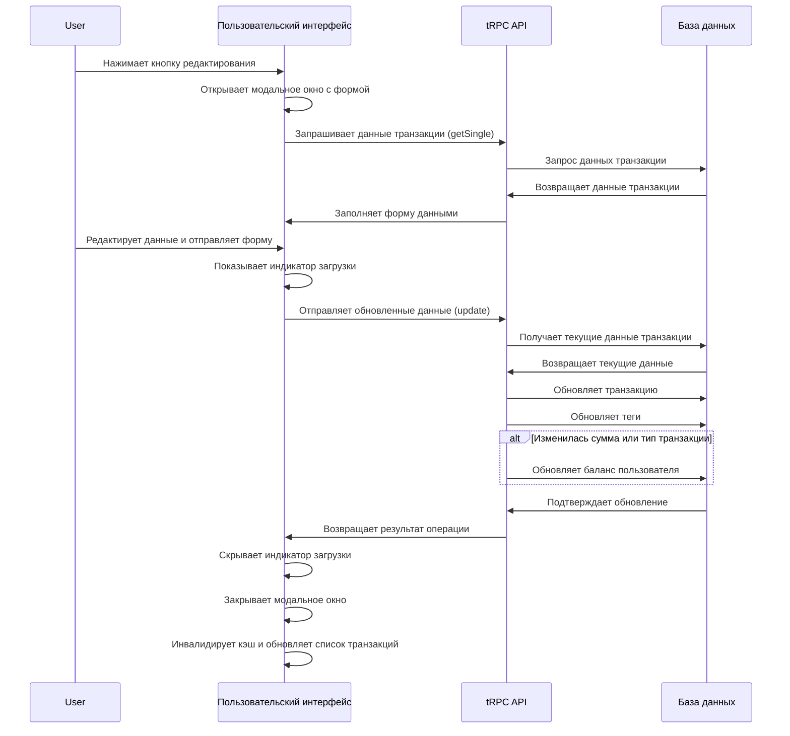

# План реализации функционала редактирования транзакций

## 1. Создание API endpoint для обновления транзакции

### Файл: `src/server/api/routers/transactions.ts`

Добавить новую мутацию `update` в `transactionsRouter`:

```typescript
update: protectedProcedure
  .input(
    TransactionCreateSchema
      .omit({ ownerId: true })
      .extend({ 
        id: z.number(),
        tags: z.array(z.string()) 
      })
  )
  .mutation(async ({ ctx, input }) => {
    // 1. Получить текущую транзакцию
    // 2. Проверить, что транзакция принадлежит пользователю
    // 3. Обновить баланс пользователя:
    //    - Отменить влияние старой транзакции
    //    - Применить влияние новой транзакции
    // 4. Обновить транзакцию
    // 5. Обновить теги (удалить старые, добавить новые)
    // 6. Вернуть результат
  }),
```

## 2. Создание компонента модального окна для редактирования

### Файл: `src/app/transactions/edit.tsx`

Создать компонент для редактирования транзакции:

```typescript
'use client';

import { type FC, useState, useEffect } from 'react';
import {
  Dialog,
  DialogContent,
  DialogHeader,
  DialogTitle,
  DialogFooter,
} from '@/app/_components/ui/dialog';
import { Button } from '@/app/_components/ui/button';
import { api } from '@/trpc/react';
import { type Transaction } from '@/types/transaction';

// Форма редактирования, похожая на форму создания
// Предзаполнение данных из существующей транзакции
// Индикатор загрузки при отправке формы
// Инвалидирование кэша после успешного обновления
```

## 3. Обновление компонента Row

### Файл: `src/app/transactions/row.tsx`

Обновить компонент Row для поддержки редактирования:

```typescript
// Включить кнопку редактирования (убрать атрибут disabled)
// Добавить состояние для открытия/закрытия модального окна
// Добавить обработчик клика для кнопки редактирования
// Интегрировать компонент редактирования
```

## 4. Инвалидирование кэша

После успешного обновления транзакции:

```typescript
// Инвалидировать кэш транзакций
await utils.transactions.invalidate(undefined, { refetchType: 'all' });
// Инвалидировать кэш баланса пользователя
await utils.users.getBalance.invalidate(undefined, { refetchType: 'all' });
```

## 5. Диаграмма потока данных



## 6. Детали реализации обновления баланса

При обновлении транзакции нам нужно корректно обновить баланс пользователя:

1. Если тип транзакции (доход/расход) не изменился:
   - Если сумма увеличилась:
     - Для дохода: добавить разницу к балансу
     - Для расхода: вычесть разницу из баланса
   - Если сумма уменьшилась:
     - Для дохода: вычесть разницу из баланса
     - Для расхода: добавить разницу к балансу

2. Если тип транзакции изменился:
   - Отменить старую транзакцию (вычесть доход или добавить расход)
   - Применить новую транзакцию (добавить доход или вычесть расход)

## 7. Тестирование

После реализации необходимо протестировать:
- Корректность обновления данных транзакции
- Корректность обновления баланса при различных сценариях
- Корректность обновления тегов
- Корректность инвалидирования кэша и обновления UI