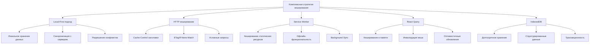

# Комплексная стратегия клиентского кеширования для приложения Worthy

## Обзор

Данный документ описывает комплексную стратегию клиентского кеширования для приложения Worthy, основанную на принципах local-first. Эта стратегия направлена на оптимизацию производительности, снижение нагрузки на сервер и улучшение пользовательского опыта, особенно в условиях нестабильного интернет-соединения.

## Ключевые компоненты стратегии



## 1. Local-First подход

### 1.1 Принципы Local-First

Local-first подход означает, что приложение в первую очередь работает с локальными данными, а затем синхронизирует их с сервером. Это обеспечивает:

- **Мгновенный отклик UI** - пользователи видят результаты своих действий немедленно
- **Офлайн-доступность** - приложение работает даже без подключения к интернету
- **Устойчивость к проблемам сети** - временные проблемы с соединением не влияют на работу пользователя
- **Снижение нагрузки на сервер** - многие операции выполняются локально

### 1.2 Архитектура Local-First

Архитектура local-first подхода включает следующие компоненты:

1. **IndexedDB** как основное хранилище данных на клиенте
2. **Очередь синхронизации** для отложенной отправки данных на сервер
3. **Механизм разрешения конфликтов** для обработки ситуаций, когда данные изменяются одновременно локально и на сервере
4. **Service Worker** для обеспечения офлайн-функциональности и фоновой синхронизации
5. **React Query** для кеширования данных в памяти и управления состоянием

### 1.3 Поток данных в Local-First архитектуре

При создании или обновлении данных:
1. Данные сначала сохраняются локально в IndexedDB
2. UI обновляется немедленно с локальными данными
3. Операция добавляется в очередь синхронизации
4. Если есть подключение к интернету, данные отправляются на сервер
5. Если нет подключения, синхронизация откладывается до восстановления соединения

При загрузке данных:
1. Данные сначала загружаются из локального хранилища
2. UI обновляется с локальными данными
3. Если есть подключение к интернету, данные запрашиваются с сервера
4. Локальные и серверные данные объединяются
5. UI обновляется с объединенными данными

## 2. Механизмы хранения в браузере

### 2.1 IndexedDB

IndexedDB используется как основное хранилище данных на клиенте из-за следующих преимуществ:

- **Большой объем хранения** - до нескольких гигабайт данных
- **Структурированное хранение** - поддержка индексов и сложных запросов
- **Транзакционность** - атомарные операции для обеспечения целостности данных
- **Асинхронный API** - не блокирует основной поток

Структура хранилищ в IndexedDB:

```javascript
const DB_NAME = 'worthyDB';
const DB_VERSION = 1;

const STORES = {
  TRANSACTIONS: 'transactions',
  TEMPLATES: 'templates',
  SHOPPING_SESSIONS: 'shoppingSessions',
  USER_SETTINGS: 'userSettings',
  SYNC_QUEUE: 'syncQueue',
};

// Инициализация базы данных
export const initDB = (): Promise<IDBDatabase> => {
  return new Promise((resolve, reject) => {
    const request = indexedDB.open(DB_NAME, DB_VERSION);
    
    request.onupgradeneeded = (event) => {
      const db = request.result;
      
      // Создаем хранилища, если их нет
      if (!db.objectStoreNames.contains(STORES.TRANSACTIONS)) {
        const store = db.createObjectStore(STORES.TRANSACTIONS, { keyPath: 'id' });
        store.createIndex('createdAt', 'createdAt', { unique: false });
        store.createIndex('updatedAt', 'updatedAt', { unique: false });
        store.createIndex('isIncome', 'isIncome', { unique: false });
      }
      
      // Аналогично для других хранилищ...
      
      if (!db.objectStoreNames.contains(STORES.SYNC_QUEUE)) {
        const store = db.createObjectStore(STORES.SYNC_QUEUE, { keyPath: 'id' });
        store.createIndex('createdAt', 'createdAt', { unique: false });
        store.createIndex('status', 'status', { unique: false });
        store.createIndex('type', 'operation.type', { unique: false });
      }
    };
    
    request.onsuccess = () => resolve(request.result);
    request.onerror = () => reject(request.error);
  });
};
```

### 2.2 LocalStorage и SessionStorage

LocalStorage и SessionStorage используются для хранения небольших объемов данных:

- **LocalStorage** - для долгосрочного хранения настроек пользователя и состояния UI
- **SessionStorage** - для временного хранения данных в рамках одной сессии

Примеры использования:

```javascript
// Сохранение настроек пользователя
export const saveUserSettings = (settings: UserSettings): void => {
  localStorage.setItem('userSettings', JSON.stringify(settings));
};

// Получение настроек пользователя
export const getUserSettings = (): UserSettings | null => {
  const settings = localStorage.getItem('userSettings');
  return settings ? JSON.parse(settings) : null;
};

// Сохранение состояния UI
export const saveUIState = (state: UIState): void => {
  sessionStorage.setItem('uiState', JSON.stringify(state));
};

// Получение состояния UI
export const getUIState = (): UIState | null => {
  const state = sessionStorage.getItem('uiState');
  return state ? JSON.parse(state) : null;
};
```

### 2.3 Сравнение механизмов хранения

| Механизм | Объем | Структура данных | Транзакционность | Использование в приложении |
|----------|-------|------------------|------------------|----------------------------|
| IndexedDB | До нескольких ГБ | Сложная, с индексами | Да | Основные данные приложения (транзакции, шаблоны, сессии) |
| LocalStorage | До 5 МБ | Простая (ключ-значение) | Нет | Настройки пользователя, токены, флаги функций |
| SessionStorage | До 5 МБ | Простая (ключ-значение) | Нет | Временное состояние UI, данные текущей сессии |
| Cache API | Ограничено браузером | Запросы и ответы | Нет | Кеширование статических ресурсов и API-ответов |

## 3. HTTP кеширование

### 3.1 Cache-Control заголовки

Для оптимизации HTTP-кеширования используются следующие заголовки Cache-Control:

| Тип ресурса | Cache-Control | Обоснование |
|-------------|---------------|-------------|
| Статические ресурсы (JS, CSS, изображения) | `public, max-age=31536000, immutable` | Долгосрочное кеширование с версионированием в URL |
| HTML | `no-cache` | Всегда проверять актуальность, но можно использовать кешированную версию |
| API-ответы | `private, max-age=60` | Короткое время кеширования для динамических данных |
| Пользовательские данные | `private, no-store` | Не кешировать чувствительные данные |

### 3.2 ETag и условные запросы

Для API-запросов используются ETag и условные запросы для оптимизации трафика:

```javascript
// Пример использования ETag на клиенте
let etag = localStorage.getItem('transactions_etag');

fetch('/api/transactions', {
  headers: etag ? { 'If-None-Match': etag } : {}
})
.then(response => {
  if (response.status === 304) {
    // Данные не изменились, используем кешированные
    return getCachedTransactions();
  }
  
  // Сохраняем новый ETag
  const newEtag = response.headers.get('ETag');
  if (newEtag) {
    localStorage.setItem('transactions_etag', newEtag);
  }
  
  return response.json();
})
.then(data => {
  // Обрабатываем данные
});
```

### 3.3 Стратегии кеширования для разных типов ресурсов

| Тип ресурса | Стратегия кеширования | Описание |
|-------------|------------------------|----------|
| Статические ресурсы | Cache-First | Сначала проверяем кеш, затем сеть |
| API-ответы | Stale-While-Revalidate | Показываем кешированные данные, обновляем в фоне |
| Пользовательские данные | Network-First | Сначала запрашиваем с сети, при ошибке используем кеш |
| Критические ресурсы | Network-Only | Всегда запрашиваем с сети |

## 4. Service Worker

### 4.1 Регистрация и жизненный цикл

```javascript
// src/lib/serviceWorker.ts
export const registerServiceWorker = async (): Promise<void> => {
  if ('serviceWorker' in navigator) {
    try {
      const registration = await navigator.serviceWorker.register('/sw.js');
      console.log('Service Worker зарегистрирован:', registration);
      
      // Подписываемся на обновления
      registration.addEventListener('updatefound', () => {
        const newWorker = registration.installing;
        if (newWorker) {
          newWorker.addEventListener('statechange', () => {
            if (newWorker.state === 'installed' && navigator.serviceWorker.controller) {
              // Новая версия доступна
              showUpdateNotification();
            }
          });
        }
      });
    } catch (error) {
      console.error('Ошибка регистрации Service Worker:', error);
    }
  }
};

// Функция для обновления Service Worker
export const updateServiceWorker = async (): Promise<void> => {
  if ('serviceWorker' in navigator) {
    const registration = await navigator.serviceWorker.ready;
    await registration.update();
  }
};
```

### 4.2 Кеширование статических ресурсов

```javascript
// public/sw.js
const CACHE_NAME = 'worthy-static-v1';
const STATIC_ASSETS = [
  '/',
  '/offline.html',
  '/favicon.ico',
  '/logo.svg',
  '/logo-192.png',
  '/logo-384.png',
  '/logo-512.png',
  // Другие статические ресурсы
];

// Установка Service Worker и кеширование статических ресурсов
self.addEventListener('install', (event) => {
  event.waitUntil(
    caches.open(CACHE_NAME)
      .then((cache) => cache.addAll(STATIC_ASSETS))
      .then(() => self.skipWaiting())
  );
});

// Активация Service Worker и очистка старых кешей
self.addEventListener('activate', (event) => {
  event.waitUntil(
    caches.keys()
      .then((cacheNames) => {
        return Promise.all(
          cacheNames
            .filter((name) => name !== CACHE_NAME)
            .map((name) => caches.delete(name))
        );
      })
      .then(() => self.clients.claim())
  );
});
```

### 4.3 Стратегии кеширования в Service Worker

```javascript
// public/sw.js (продолжение)
self.addEventListener('fetch', (event) => {
  const url = new URL(event.request.url);
  
  // Стратегия для статических ресурсов (Cache First)
  if (isStaticAsset(url)) {
    event.respondWith(
      caches.match(event.request)
        .then((response) => response || fetch(event.request)
          .then((fetchResponse) => {
            const clonedResponse = fetchResponse.clone();
            caches.open(CACHE_NAME)
              .then((cache) => cache.put(event.request, clonedResponse));
            return fetchResponse;
          })
        )
        .catch(() => {
          // Если это запрос на HTML-страницу, возвращаем офлайн-страницу
          if (event.request.headers.get('Accept')?.includes('text/html')) {
            return caches.match('/offline.html');
          }
          return new Response('Нет подключения к интернету', { status: 503 });
        })
    );
    return;
  }
  
  // Стратегия для API-запросов (Stale While Revalidate)
  if (isApiRequest(url)) {
    event.respondWith(
      caches.open('worthy-api-cache')
        .then((cache) => {
          return cache.match(event.request)
            .then((cachedResponse) => {
              const fetchPromise = fetch(event.request)
                .then((networkResponse) => {
                  cache.put(event.request, networkResponse.clone());
                  return networkResponse;
                })
                .catch(() => cachedResponse);
              
              return cachedResponse || fetchPromise;
            });
        })
    );
    return;
  }
  
  // Стратегия для остальных запросов (Network First)
  event.respondWith(
    fetch(event.request)
      .catch(() => caches.match(event.request))
  );
});

// Вспомогательные функции
function isStaticAsset(url) {
  return (
    url.pathname.endsWith('.js') ||
    url.pathname.endsWith('.css') ||
    url.pathname.endsWith('.png') ||
    url.pathname.endsWith('.jpg') ||
    url.pathname.endsWith('.svg') ||
    url.pathname.endsWith('.ico')
  );
}

function isApiRequest(url) {
  return url.pathname.includes('/api/');
}
```

### 4.4 Background Sync для офлайн-операций

```javascript
// public/sw.js (продолжение)
self.addEventListener('sync', (event) => {
  if (event.tag === 'sync-data') {
    event.waitUntil(syncData());
  }
});

// Функция для синхронизации данных
async function syncData() {
  try {
    // Открываем базу данных
    const db = await openDB();
    
    // Получаем элементы из очереди синхронизации
    const syncQueue = await getAllFromStore(db, 'syncQueue');
    
    if (!syncQueue || syncQueue.length === 0) {
      return;
    }
    
    // Сортируем по времени создания
    const sortedQueue = [...syncQueue].sort((a, b) => 
      new Date(a.createdAt).getTime() - new Date(b.createdAt).getTime()
    );
    
    for (const item of sortedQueue) {
      if (item.status !== 'pending' && item.status !== 'failed') continue;
      
      try {
        // Обновляем статус
        item.status = 'processing';
        item.attempts += 1;
        await updateInStore(db, 'syncQueue', item);
        
        // Выполняем операцию на сервере
        await syncItemWithServer(item);
        
        // Если успешно, удаляем из очереди
        await deleteFromStore(db, 'syncQueue', item.id);
      } catch (error) {
        console.error('Ошибка синхронизации в Service Worker:', error);
        
        // Обновляем статус
        item.status = 'failed';
        await updateInStore(db, 'syncQueue', item);
        
        // Если превышено количество попыток, помечаем как требующее ручного разрешения
        if (item.attempts >= 5) {
          item.status = 'manual_resolution_required';
          await updateInStore(db, 'syncQueue', item);
        }
      }
    }
  } catch (error) {
    console.error('Ошибка синхронизации данных:', error);
  }
}
```

## 5. Интеграция с React Query

### 5.1 Настройка React Query

```typescript
// src/trpc/react.tsx
'use client';

import { QueryClient, QueryClientProvider } from '@tanstack/react-query';
import { loggerLink, unstable_httpBatchStreamLink } from '@trpc/client';
import { createTRPCReact } from '@trpc/react-query';

import { type ReactNode, useState, useEffect } from 'react';

import { type AppRouter } from '@/server/api/root';
import { getUrl, transformer } from './shared';
import { setupPersistQueryClient } from '@/lib/persistQueryClient';
import { registerServiceWorker } from '@/lib/serviceWorker';
import { setupSyncEventListeners } from '@/lib/localDB';

export const api = createTRPCReact<AppRouter>();

export function TRPCReactProvider(props: { children: ReactNode }) {
    const [queryClient] = useState(() => new QueryClient({
        defaultOptions: {
            queries: {
                retry: 1,
                refetchOnMount: false,
                refetchOnWindowFocus: false,
                staleTime: 60 * 1000, // 1 минута
                cacheTime: 5 * 60 * 1000, // 5 минут
            },
        },
    }));

    // Настраиваем персистентное хранение кеша и local-first функциональность
    useEffect(() => {
        if (typeof window !== 'undefined') {
            // Настраиваем персистентное хранение кеша React Query
            setupPersistQueryClient(queryClient);
            
            // Регистрируем Service Worker для PWA
            registerServiceWorker();
            
            // Настраиваем обработчики событий для синхронизации
            setupSyncEventListeners();
        }
    }, [queryClient]);

    const [trpcClient] = useState(() =>
        api.createClient({
            transformer,
            links: [
                loggerLink({
                    enabled: (op) =>
                        process.env.NODE_ENV === 'development' ||
                        (op.direction === 'down' && op.result instanceof Error),
                }),
                unstable_httpBatchStreamLink({
                    url: getUrl(),
                }),
            ],
        }),
    );

    return (
        <QueryClientProvider client={queryClient}>
            <api.Provider client={trpcClient} queryClient={queryClient}>
                {props.children}
            </api.Provider>
        </QueryClientProvider>
    );
}
```

### 5.2 Персистентное хранение кеша React Query

```typescript
// src/lib/persistQueryClient.ts
import { QueryClient } from '@tanstack/react-query';
import { saveToIndexedDB, getFromIndexedDB } from './indexedDB';
import { debounce } from './utils';

const QUERY_CACHE_KEY = 'reactQueryCache';

// Конфигурация кеширования для разных типов запросов
export const CACHE_CONFIG = {
  default: {
    staleTime: 60 * 1000, // 1 минута
    cacheTime: 5 * 60 * 1000, // 5 минут
  },
  transactions: {
    staleTime: 2 * 60 * 1000, // 2 минуты
    cacheTime: 10 * 60 * 1000, // 10 минут
  },
  templates: {
    staleTime: 5 * 60 * 1000, // 5 минут
    cacheTime: 30 * 60 * 1000, // 30 минут
  },
  userSettings: {
    staleTime: 10 * 60 * 1000, // 10 минут
    cacheTime: 60 * 60 * 1000, // 1 час
  },
};

// Функция для сохранения кеша в IndexedDB
const saveCache = async (queryClient: QueryClient): Promise<void> => {
  try {
    const cache = queryClient.getQueryCache().getAll().map(query => ({
      queryKey: query.queryKey,
      data: query.state.data,
      dataUpdatedAt: query.state.dataUpdatedAt,
    }));
    
    await saveToIndexedDB('reactQueryCache', { id: QUERY_CACHE_KEY, cache });
  } catch (error) {
    console.error('Ошибка сохранения кеша React Query:', error);
  }
};

// Дебаунсинг для предотвращения слишком частых записей
const debouncedSaveCache = debounce(saveCache, 1000);

// Функция для восстановления кеша из IndexedDB
const restoreCache = async (queryClient: QueryClient): Promise<void> => {
  try {
    const cacheData = await getFromIndexedDB('reactQueryCache', QUERY_CACHE_KEY);
    
    if (cacheData?.cache) {
      cacheData.cache.forEach(item => {
        queryClient.setQueryData(item.queryKey, item.data);
      });
    }
  } catch (error) {
    console.error('Ошибка восстановления кеша React Query:', error);
  }
};

// Настройка персистентного хранения кеша
export const setupPersistQueryClient = (queryClient: QueryClient): () => void => {
  // Восстанавливаем кеш при инициализации
  restoreCache(queryClient).catch(console.error);
  
  // Подписываемся на изменения кеша
  const unsubscribe = queryClient.getQueryCache().subscribe(() => {
    // Используем функцию-обертку для предотвращения ошибки no-misused-promises
    const saveCache = () => {
      debouncedSaveCache(queryClient);
    };
    saveCache();
  });
  
  return unsubscribe;
};

// Функция для очистки кеша при выходе из системы
export const clearCacheOnSignOut = async (): Promise<void> => {
  try {
    await saveToIndexedDB('reactQueryCache', { id: QUERY_CACHE_KEY, cache: [] });
    console.log('Кеш React Query очищен');
  } catch (error) {
    console.error('Ошибка очистки кеша React Query:', error);
  }
};
```

## 6. Безопасность и целостность данных

### 6.1 Шифрование чувствительных данных

```typescript
// src/lib/securityUtils.ts
import { AES, enc } from 'crypto-js';

// Секретный ключ для шифрования (в реальном приложении должен быть получен безопасным способом)
const SECRET_KEY = 'your-secret-key';

// Функция для шифрования данных
export const encryptData = (data: any): string => {
  const jsonString = JSON.stringify(data);
  return AES.encrypt(jsonString, SECRET_KEY).toString();
};

// Функция для дешифрования данных
export const decryptData = (encryptedData: string): any => {
  const bytes = AES.decrypt(encryptedData, SECRET_KEY);
  const decryptedString = bytes.toString(enc.Utf8);
  return JSON.parse(decryptedString);
};

// Функция для сохранения чувствительных данных с шифрованием
export const saveSecureData = (key: string, data: any): void => {
  const encryptedData = encryptData(data);
  localStorage.setItem(key, encryptedData);
};

// Функция для получения чувствительных данных с дешифрованием
export const getSecureData = (key: string): any | null => {
  const encryptedData = localStorage.getItem(key);
  if (!encryptedData) return null;
  
  try {
    return decryptData(encryptedData);
  } catch (error) {
    console.error('Ошибка дешифрования данных:', error);
    return null;
  }
};
```

### 6.2 Проверка целостности данных

```typescript
// src/lib/integrityCheck.ts
import { createHash } from 'crypto';

// Функция для создания хеша данных
export const createDataHash = (data: any): string => {
  const jsonString = JSON.stringify(data);
  return createHash('sha256').update(jsonString).digest('hex');
};

// Функция для сохранения данных с хешем
export const saveWithIntegrityCheck = async (storeName: string, data: any): Promise<void> => {
  const dataHash = createDataHash(data);
  
  // Сохраняем данные
  await saveToIndexedDB(storeName, data);
  
  // Сохраняем хеш
  await saveToIndexedDB('dataHashes', { id: `${storeName}_${data.id}`, hash: dataHash });
};

// Функция для получения данных с проверкой целостности
export const getWithIntegrityCheck = async (storeName: string, id: string): Promise<any> => {
  // Получаем данные
  const data = await getFromIndexedDB(storeName, id);
  if (!data) return null;
  
  // Получаем сохраненный хеш
  const hashRecord = await getFromIndexedDB('dataHashes', `${storeName}_${id}`);
  if (!hashRecord) return data; // Если хеша нет, возвращаем данные без проверки
  
  // Создаем новый хеш и сравниваем
  const currentHash = createDataHash(data);
  
  if (currentHash !== hashRecord.hash) {
    console.error('Нарушена целостность данных:', storeName, id);
    return null;
  }
  
  return data;
};
```

### 6.3 Очистка данных при выходе из системы

```typescript
// src/lib/authUtils.ts
import { clearCacheOnSignOut } from './persistQueryClient';

// Функция для очистки всех данных при выходе из системы
export const clearDataOnSignOut = async (): Promise<void> => {
  try {
    // Очищаем кеш React Query
    await clearCacheOnSignOut();
    
    // Очищаем локальные хранилища
    localStorage.removeItem('userSettings');
    localStorage.removeItem('authToken');
    sessionStorage.clear();
    
    // Очищаем IndexedDB (кроме некоторых системных хранилищ)
    const db = await initDB();
    const storeNames = Array.from(db.objectStoreNames).filter(name => 
      name !== 'syncQueue' && name !== 'dataHashes'
    );
    
    for (const storeName of storeNames) {
      const transaction = db.transaction(storeName, 'readwrite');
      const store = transaction.objectStore(storeName);
      store.clear();
    }
    
    console.log('Все данные пользователя очищены');
  } catch (error) {
    console.error('Ошибка очистки данных:', error);
  }
};
```

## 7. Рекомендации по реализации

### 7.1 Для разных типов ресурсов

| Тип ресурса | Механизм хранения | Стратегия кеширования | Время жизни кеша |
|-------------|-------------------|------------------------|------------------|
| Транзакции | IndexedDB | Local-First | Неограниченно (с очисткой старых) |
| Шаблоны | IndexedDB | Local-First | Неограниченно |
| Сессии покупок | IndexedDB | Local-First | Неограниченно (с очисткой старых) |
| Настройки пользователя | LocalStorage + IndexedDB | Local-First | До выхода из системы |
