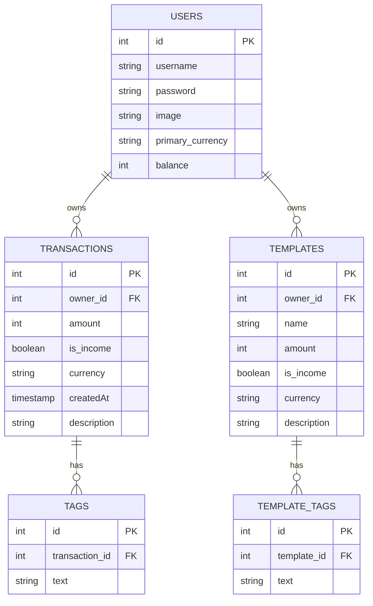
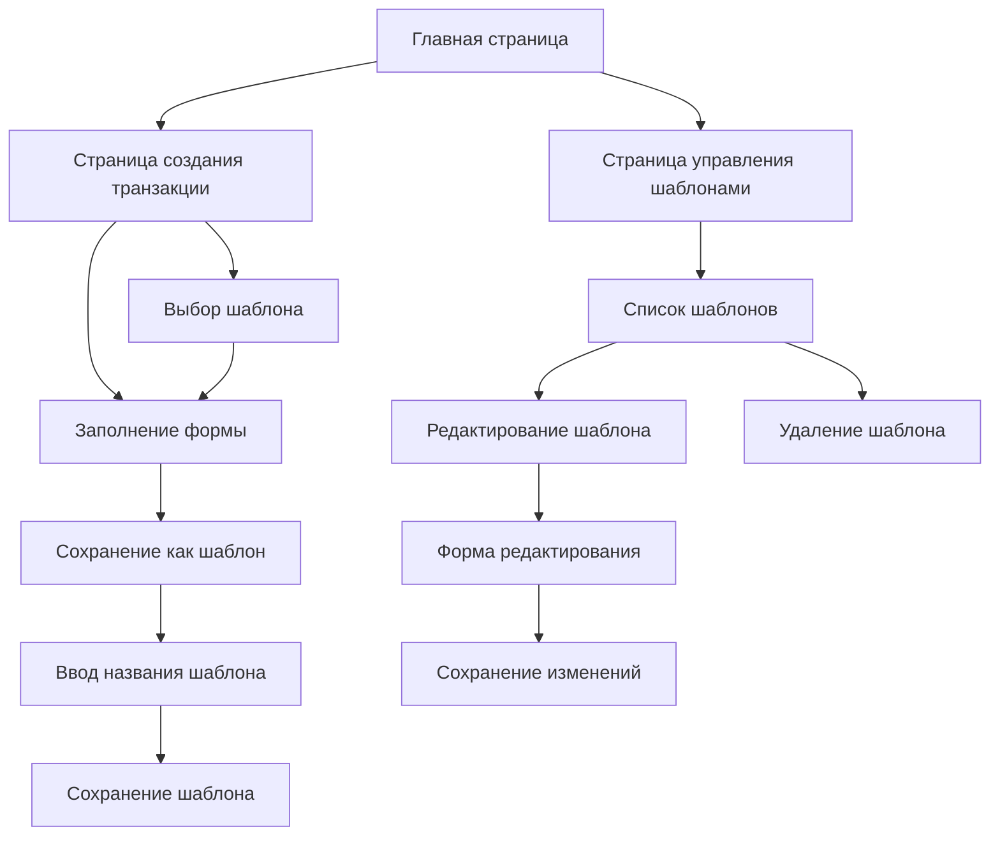

# План добавления функциональности шаблонных трат

## Описание задачи

Добавить возможность:
1. Сохранять текущую форму создания транзакции как шаблон с заданным названием
2. Выбирать шаблон при создании новой транзакции, чтобы получить предзаполненную форму
3. Управлять шаблонами (просмотр, редактирование, удаление) на отдельной странице

## Структура данных

### Новые таблицы

1. **templates** - таблица для хранения шаблонов транзакций
   - `id` - уникальный идентификатор шаблона
   - `owner_id` - идентификатор владельца шаблона (ссылка на таблицу users)
   - `name` - название шаблона
   - `amount` - сумма
   - `is_income` - флаг дохода/расхода
   - `currency` - валюта
   - `description` - описание

2. **template_tags** - таблица для хранения тегов, связанных с шаблонами
   - `id` - уникальный идентификатор записи
   - `template_id` - идентификатор шаблона (ссылка на таблицу templates)
   - `text` - текст тега

### Диаграмма структуры данных



## API для работы с шаблонами

Создать новый роутер `templatesRouter` в API с следующими методами:

1. **getList** - получение списка шаблонов пользователя
   - Входные данные: нет
   - Выходные данные: массив шаблонов с их тегами

2. **getSingle** - получение одного шаблона по ID
   - Входные данные: ID шаблона
   - Выходные данные: шаблон с его тегами

3. **create** - создание нового шаблона
   - Входные данные: название, сумма, флаг дохода/расхода, валюта, описание, теги
   - Выходные данные: результат операции (успех/ошибка)

4. **update** - редактирование существующего шаблона
   - Входные данные: ID шаблона, название, сумма, флаг дохода/расхода, валюта, описание, теги
   - Выходные данные: результат операции (успех/ошибка)

5. **delete** - удаление шаблона
   - Входные данные: ID шаблона
   - Выходные данные: результат операции (успех/ошибка)

## Пользовательский интерфейс

### 1. Модификация формы создания транзакции

На странице `/new`:
- Добавить компонент выбора шаблона в верхней части формы
- Добавить кнопку "Сохранить как шаблон" рядом с кнопкой "Submit"
- Добавить диалоговое окно для ввода названия шаблона при нажатии на кнопку "Сохранить как шаблон"

### 2. Создание страницы управления шаблонами

Создать новую страницу `/templates`:
- Список всех шаблонов пользователя с информацией о каждом шаблоне (название, сумма, тип, теги)
- Кнопки для редактирования и удаления шаблонов
- Кнопка для создания нового шаблона (опционально)

### 3. Создание компонента редактирования шаблона

Создать компонент для редактирования шаблона:
- Форма, аналогичная форме создания транзакции, но с дополнительным полем для названия шаблона
- Предзаполнение формы данными выбранного шаблона
- Кнопки для сохранения изменений или отмены

### Диаграмма пользовательского интерфейса



## Детальный план реализации

### 1. Создание схемы данных для шаблонов

1.1. Создать файл `src/server/db/tables/template.ts`:
```typescript
import { int, sqliteTable, text } from 'drizzle-orm/sqlite-core';
import { usersTable } from '@/server/db/tables/user';

export const templatesTable = sqliteTable('templates', {
    id: int('id').primaryKey({ autoIncrement: true }).notNull(),
    ownerId: int('owner_id').notNull().references(() => usersTable.id, { onDelete: 'cascade' }),
    name: text('name').notNull(),
    amount: int('amount').notNull(),
    isIncome: int('is_income', { mode: 'boolean' }).notNull(),
    currency: text('currency', { length: 3 }).notNull(),
    description: text('description').notNull(),
});
```

1.2. Создать файл `src/server/db/tables/template_tags.ts`:
```typescript
import { int, sqliteTable, text } from 'drizzle-orm/sqlite-core';
import { templatesTable } from '@/server/db/tables/template';

export const templateTagsTable = sqliteTable('template_tags', {
    id: int('id').primaryKey({ autoIncrement: true }).notNull(),
    templateId: int('template_id').notNull().references(() => templatesTable.id, { onDelete: 'cascade' }),
    text: text('text').notNull(),
});
```

1.3. Обновить файл `src/server/db/schema.ts`, добавив экспорт новых таблиц:
```typescript
export * from './tables/user';
export * from './tables/transaction';
export * from './tables/tags';
export * from './tables/template';
export * from './tables/template_tags';
```

### 2. Создание типов для шаблонов

2.1. Создать файл `src/types/template.ts`:
```typescript
import type { InferSelectModel } from 'drizzle-orm';
import { createInsertSchema } from 'drizzle-zod';
import { templatesTable } from '@/server/db/tables/template';

export type Template = InferSelectModel<typeof templatesTable>;
export const TemplateCreateSchema = createInsertSchema(templatesTable);
```

### 3. Создание API для работы с шаблонами

3.1. Создать файл `src/server/api/routers/templates.ts`:
```typescript
import { createTRPCRouter, protectedProcedure } from '@/server/api/trpc';
import { templatesTable } from '@/server/db/tables/template';
import { templateTagsTable } from '@/server/db/tables/template_tags';
import { TemplateCreateSchema } from '@/types/template';
import { z } from 'zod';
import { and, eq } from 'drizzle-orm';

export const templatesRouter = createTRPCRouter({
    // Получение списка шаблонов пользователя
    getList: protectedProcedure.query(async ({ ctx }) => {
        const templates = await ctx.db
            .select()
            .from(templatesTable)
            .where(eq(templatesTable.ownerId, ctx.session.user.id));
            
        // Для каждого шаблона получаем его теги
        const result = await Promise.all(templates.map(async (template) => {
            const tags = await ctx.db
                .select({ text: templateTagsTable.text })
                .from(templateTagsTable)
                .where(eq(templateTagsTable.templateId, template.id));
                
            return {
                ...template,
                amount: template.amount / 100, // Форматируем сумму
                tags: tags.map(tag => tag.text),
            };
        }));
        
        return result;
    }),
    
    // Получение одного шаблона по ID
    getSingle: protectedProcedure
        .input(z.number())
        .query(async ({ ctx, input }) => {
            const template = await ctx.db
                .select()
                .from(templatesTable)
                .where(and(
                    eq(templatesTable.id, input),
                    eq(templatesTable.ownerId, ctx.session.user.id),
                ));
                
            if (!template[0]) {
                return null;
            }
            
            // Получаем теги для шаблона
            const tags = await ctx.db
                .select({ text: templateTagsTable.text })
                .from(templateTagsTable)
                .where(eq(templateTagsTable.templateId, input));
                
            return {
                ...template[0],
                amount: template[0].amount / 100, // Форматируем сумму
                tags: tags.map(tag => tag.text),
            };
        }),
    
    // Создание нового шаблона
    create: protectedProcedure
        .input(TemplateCreateSchema
            .omit({ ownerId: true, id: true })
            .extend({ 
                tags: z.array(z.string()),
                name: z.string(),
                amount: z.number(),
            }),
        )
        .mutation(async ({ ctx, input }) => {
            const { tags, ...rest } = input;
            const formatted = Math.floor(input.amount * 100);
            
            // Вставляем шаблон
            const resp = await ctx.db
                .insert(templatesTable)
                .values({
                    ...rest,
                    amount: formatted,
                    ownerId: ctx.session.user.id,
                })
                .returning({ insertedId: templatesTable.id });
                
            if (!tags?.length) {
                return true;
            }
            
            // Вставляем теги для шаблона
            const tagsValues = tags.map((el) => {
                return {
                    templateId: Number(resp[0]!.insertedId),
                    text: el,
                };
            });
            
            await ctx.db
                .insert(templateTagsTable)
                .values(tagsValues);
                
            return true;
        }),
    
    // Редактирование существующего шаблона
    update: protectedProcedure
        .input(TemplateCreateSchema
            .omit({ ownerId: true })
            .extend({
                id: z.number(),
                tags: z.array(z.string()),
                name: z.string(),
                amount: z.number(),
            }),
        )
        .mutation(async ({ ctx, input }) => {
            try {
                // Проверяем, что шаблон существует и принадлежит пользователю
                const currentTemplate = await ctx.db
                    .select({
                        ownerId: templatesTable.ownerId,
                    })
                    .from(templatesTable)
                    .where(eq(templatesTable.id, input.id));
                    
                if (!currentTemplate[0]) {
                    throw new Error("Шаблон не найден");
                }
                
                if (currentTemplate[0].ownerId !== ctx.session.user.id) {
                    throw new Error("У вас нет прав на редактирование этого шаблона");
                }
                
                const { tags, id, ...rest } = input;
                const formatted = Math.floor(input.amount * 100);
                
                // Используем транзакцию базы данных для обеспечения согласованности данных
                await ctx.db.transaction(async (tx) => {
                    // Обновляем шаблон
                    await tx
                        .update(templatesTable)
                        .set({
                            ...rest,
                            amount: formatted,
                        })
                        .where(eq(templatesTable.id, id));
                        
                    // Обновляем теги (удаляем старые, добавляем новые)
                    await tx
                        .delete(templateTagsTable)
                        .where(eq(templateTagsTable.templateId, id));
                        
                    if (tags?.length) {
                        const tagsValues = tags.map((el) => {
                            return {
                                templateId: id,
                                text: el,
                            };
                        });
                        
                        await tx
                            .insert(templateTagsTable)
                            .values(tagsValues);
                    }
                });
                
                return true;
            } catch (error) {
                throw error;
            }
        }),
    
    // Удаление шаблона
    delete: protectedProcedure
        .input(z.number())
        .mutation(async ({ ctx, input }) => {
            // Проверяем, что шаблон существует и принадлежит пользователю
            const template = await ctx.db
                .select({
                    ownerId: templatesTable.ownerId,
                })
                .from(templatesTable)
                .where(and(
                    eq(templatesTable.id, input),
                    eq(templatesTable.ownerId, ctx.session.user.id),
                ));
                
            if (!template[0]) {
                return false;
            }
            
            // Удаляем шаблон (теги удалятся автоматически благодаря каскадному удалению)
            await ctx.db
                .delete(templatesTable)
                .where(eq(templatesTable.id, input));
                
            return true;
        }),
});
```

3.2. Обновить файл `src/server/api/root.ts`, добавив новый роутер:
```typescript
import { templatesRouter } from './routers/templates';

export const appRouter = createTRPCRouter({
    // Существующие роутеры
    transactions: transactionsRouter,
    users: usersRouter,
    auth: authRouter,
    // Новый роутер
    templates: templatesRouter,
});
```

### 4. Модификация формы создания транзакции

4.1. Создать компонент выбора шаблона `src/app/new/template-selector.tsx`:
```tsx
'use client';

import { type FC } from 'react';
import { api } from '@/trpc/react';
import { Select, SelectContent, SelectItem, SelectTrigger, SelectValue } from '@/app/_components/ui/select';

interface Props {
    onSelectTemplate: (templateId: number) => void;
}

const TemplateSelector: FC<Props> = ({ onSelectTemplate }) => {
    const { data: templates, isLoading } = api.templates.getList.useQuery();
    
    if (isLoading || !templates?.length) {
        return null;
    }
    
    return (
        <div className="mb-4">
            <Select onValueChange={(value) => onSelectTemplate(Number(value))}>
                <SelectTrigger>
                    <SelectValue placeholder="Выберите шаблон" />
                </SelectTrigger>
                <SelectContent>
                    {templates.map((template) => (
                        <SelectItem key={`template-${template.id}`} value={String(template.id)}>
                            {template.name}
                        </SelectItem>
                    ))}
                </SelectContent>
            </Select>
        </div>
    );
};

export default TemplateSelector;
```

4.2. Модифицировать форму создания транзакции `src/app/new/form.tsx` для добавления функциональности шаблонов.

### 5. Создание страницы управления шаблонами

5.1. Создать файл `src/app/templates/page.tsx` для отображения списка шаблонов и управления ими.

5.2. Создать компоненты для редактирования и удаления шаблонов:
- `src/app/templates/edit.tsx`
- `src/app/templates/delete.tsx`

### 6. Создание миграции для новых таблиц

6.1. Создать миграцию для добавления новых таблиц в базу данных.

## Заключение

Реализация функциональности шаблонных трат позволит пользователям:
1. Сохранять часто используемые транзакции как шаблоны
2. Быстро создавать новые транзакции на основе шаблонов
3. Управлять своими шаблонами через удобный интерфейс

Это значительно улучшит пользовательский опыт и сделает приложение более удобным для повседневного использования.
