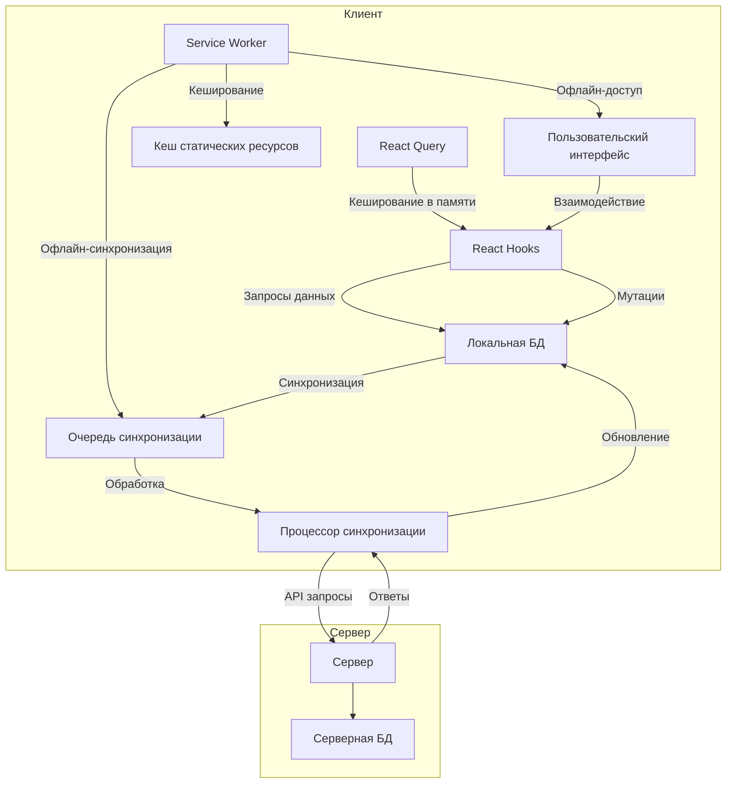
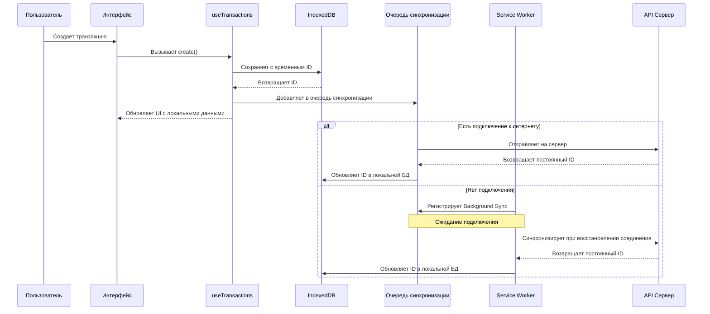
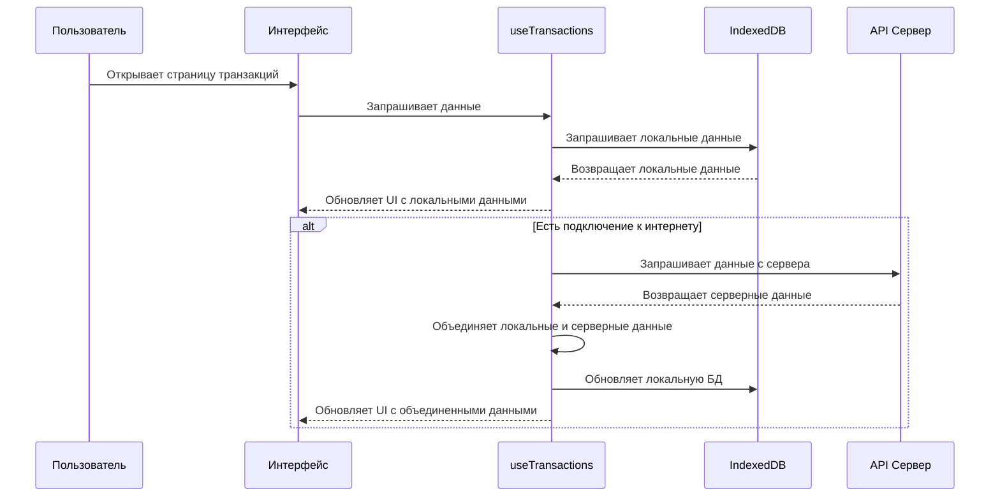
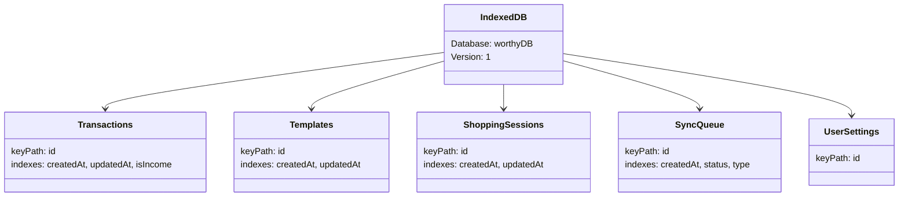
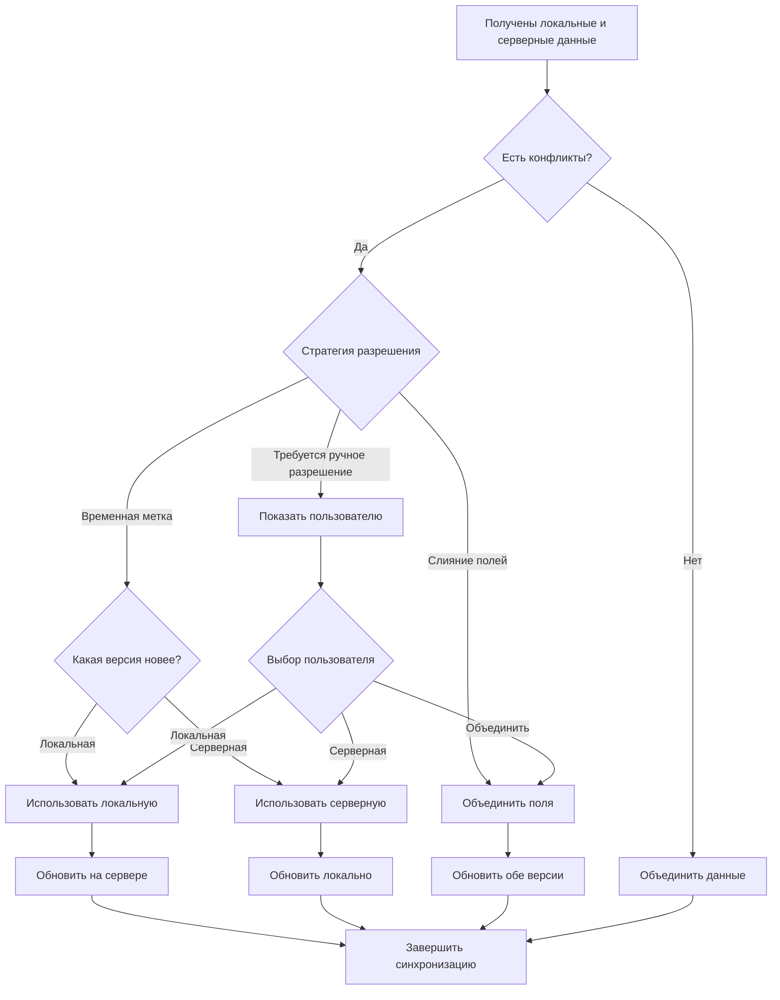
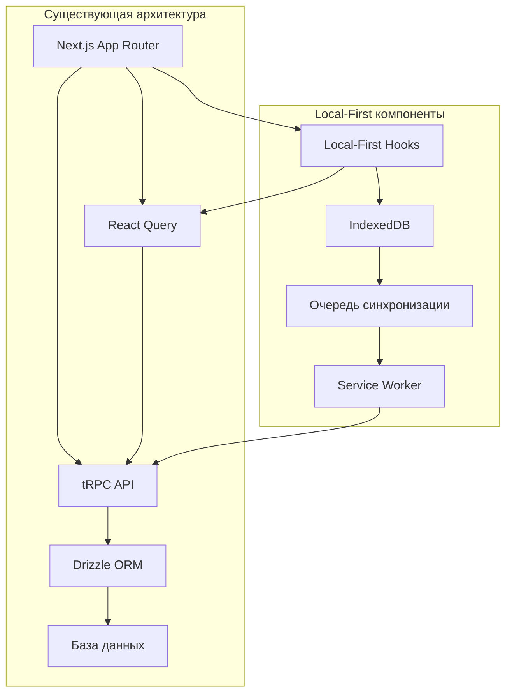

# Архитектура Local-First для приложения Worthy

## Общая архитектура

## Поток данных при создании транзакции

## Поток данных при загрузке транзакций

## Структура хранилищ IndexedDB

## Стратегия разрешения конфликтов

## Интеграция с существующей архитектурой

Эти диаграммы наглядно демонстрируют архитектуру local-first подхода и его интеграцию с существующей системой. Такой подход обеспечит отличный пользовательский опыт даже при нестабильном интернет-соединении, сохраняя при этом все преимущества серверной синхронизации данных.