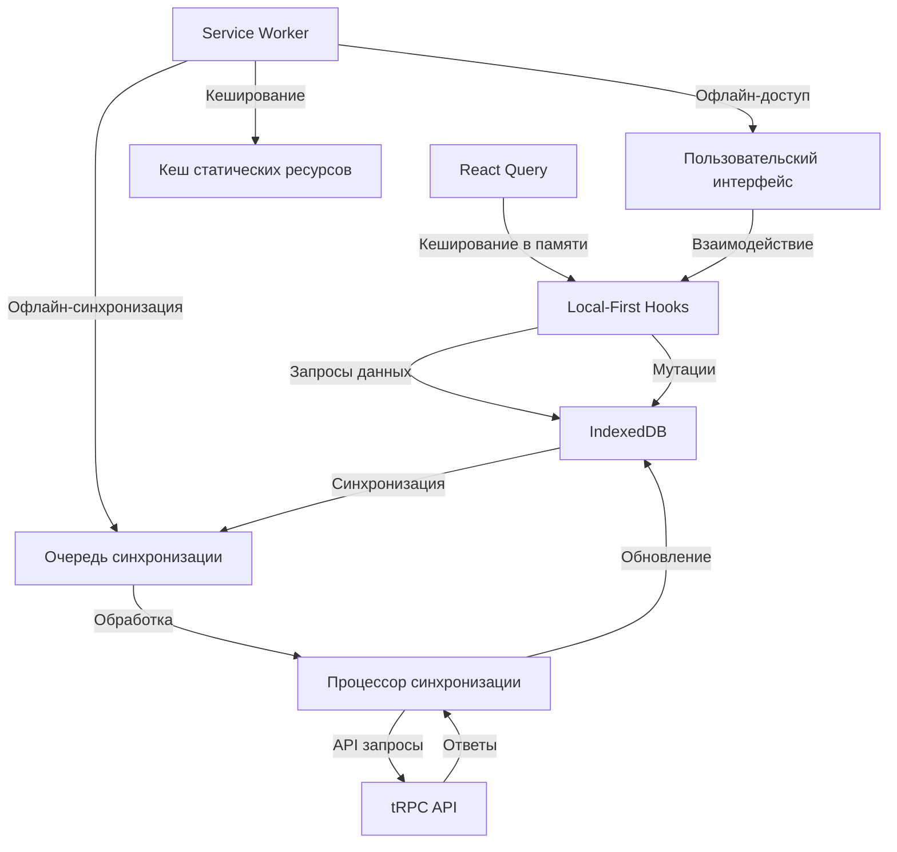

# План реализации Local-First подхода для приложения Worthy

## Обзор текущей архитектуры

На основе изученных файлов я вижу, что приложение Worthy построено на следующем стеке технологий:

- **Frontend**: Next.js с App Router
- **API**: tRPC для типизированного взаимодействия клиент-сервер
- **Кеширование**: React Query с персистентным хранением в IndexedDB
- **База данных**: Drizzle ORM для работы с SQL базой данных
- **PWA**: Service Worker для кеширования и офлайн-доступа

Приложение уже имеет некоторые компоненты, необходимые для local-first подхода:
- Базовая работа с IndexedDB
- Начальная реализация Service Worker
- Механизм кеширования запросов через React Query

## Цели внедрения Local-First подхода

1. **Мгновенный отклик UI** - пользователи должны видеть результаты своих действий немедленно
2. **Офлайн-доступность** - приложение должно работать даже без подключения к интернету
3. **Устойчивость к проблемам сети** - временные проблемы с соединением не должны влиять на работу пользователя
4. **Снижение нагрузки на сервер** - многие операции должны выполняться локально

## Архитектурное решение

Предлагаю следующую архитектуру для local-first подхода:



## Детальный план реализации

### Фаза 1: Подготовка инфраструктуры (1-2 недели)

#### 1.1. Расширение IndexedDB

Текущая реализация IndexedDB уже содержит основные хранилища, но нужно добавить:

```typescript
// Обновление src/lib/indexedDB.ts

export const initDB = (): Promise<IDBDatabase> => {
  return new Promise((resolve, reject) => {
    const request = indexedDB.open('worthyDB', 2); // Увеличиваем версию
    
    // ... существующий код ...
    
    request.onupgradeneeded = (event) => {
      const db = request.result;
      const oldVersion = event.oldVersion;
      
      // Если это новая база или обновление с версии 1
      if (oldVersion < 1) {
        // Создаем существующие хранилища
        if (!db.objectStoreNames.contains('transactions')) {
          const store = db.createObjectStore('transactions', { keyPath: 'id' });
          store.createIndex('createdAt', 'createdAt', { unique: false });
          store.createIndex('updatedAt', 'updatedAt', { unique: false });
          store.createIndex('isIncome', 'isIncome', { unique: false });
        }
        
        // ... другие существующие хранилища ...
      }
      
      // Добавляем новые хранилища для версии 2
      if (oldVersion < 2) {
        // Хранилище для очереди синхронизации
        if (!db.objectStoreNames.contains('syncQueue')) {
          const store = db.createObjectStore('syncQueue', { keyPath: 'id' });
          store.createIndex('createdAt', 'createdAt', { unique: false });
          store.createIndex('status', 'status', { unique: false });
          store.createIndex('type', 'operation.type', { unique: false });
        }
        
        // Хранилище для сессий покупок
        if (!db.objectStoreNames.contains('shoppingSessions')) {
          const store = db.createObjectStore('shoppingSessions', { keyPath: 'id' });
          store.createIndex('createdAt', 'createdAt', { unique: false });
          store.createIndex('updatedAt', 'updatedAt', { unique: false });
        }
      }
    };
  });
};
```

#### 1.2. Создание системы очереди синхронизации

```typescript
// src/lib/syncQueue.ts

import { saveToIndexedDB, getFromIndexedDB, removeFromIndexedDB } from './indexedDB';

// Типы операций для синхронизации
export type SyncOperation = {
  type: 'transaction' | 'template' | 'shoppingSession';
  action: 'create' | 'update' | 'delete';
  data: any;
  id: string | number;
};

// Статусы элементов очереди
export type SyncStatus = 'pending' | 'processing' | 'failed' | 'manual_resolution_required';

// Элемент очереди синхронизации
export type SyncQueueItem = {
  id: string;
  operation: SyncOperation;
  createdAt: string;
  attempts: number;
  status: SyncStatus;
};

// Добавление операции в очередь синхронизации
export const addToSyncQueue = async (operation: SyncOperation): Promise<void> => {
  const queueItem: SyncQueueItem = {
    id: `${Date.now()}_${Math.random().toString(36).substr(2, 9)}`,
    operation,
    createdAt: new Date().toISOString(),
    attempts: 0,
    status: 'pending',
  };
  
  await saveToIndexedDB('syncQueue', queueItem);
  
  // Запускаем синхронизацию, если есть подключение к интернету
  if (navigator.onLine) {
    void processSyncQueue();
  }
};

// Обработка очереди синхронизации
export const processSyncQueue = async (): Promise<void> => {
  if (!navigator.onLine) return;
  
  const queue = await getFromIndexedDB<SyncQueueItem[]>('syncQueue');
  if (!Array.isArray(queue) || queue.length === 0) return;
  
  // Сортируем по времени создания
  const sortedQueue = [...queue].sort((a, b) => 
    new Date(a.createdAt).getTime() - new Date(b.createdAt).getTime()
  );
  
  for (const item of sortedQueue) {
    if (item.status !== 'pending') continue;
    
    try {
      // Обновляем статус
      item.status = 'processing';
      item.attempts += 1;
      await saveToIndexedDB('syncQueue', item);
      
      // Выполняем операцию на сервере
      await syncItemWithServer(item);
      
      // Если успешно, удаляем из очереди
      await removeFromIndexedDB('syncQueue', item.id);
    } catch (error) {
      console.error('Ошибка синхронизации:', error);
      
      // Обновляем статус и увеличиваем счетчик попыток
      item.status = 'failed';
      await saveToIndexedDB('syncQueue', item);
      
      // Если превышено количество попыток, помечаем как требующее ручного разрешения
      if (item.attempts >= 5) {
        item.status = 'manual_resolution_required';
        await saveToIndexedDB('syncQueue', item);
      }
    }
  }
};

// Функция для синхронизации элемента с сервером
const syncItemWithServer = async (queueItem: SyncQueueItem): Promise<void> => {
  // Реализация синхронизации с сервером через tRPC
  // ...
};

// Настройка обработчиков событий для синхронизации
export const setupSyncEventListeners = (): void => {
  // Синхронизация при восстановлении соединения
  window.addEventListener('online', () => {
    void processSyncQueue();
  });
  
  // Регистрация Background Sync, если поддерживается
  if ('serviceWorker' in navigator && 'SyncManager' in window) {
    navigator.serviceWorker.ready.then(registration => {
      registration.sync.register('sync-data')
        .catch(error => console.error('Ошибка регистрации синхронизации:', error));
    });
  }
};
```

#### 1.3. Обновление Service Worker

```javascript
// public/sw.js (дополнение)

// Обработчик события синхронизации
self.addEventListener('sync', (event) => {
  if (event.tag === 'sync-data') {
    event.waitUntil(syncData());
  }
});

// Функция для синхронизации данных
async function syncData() {
  try {
    // Открываем базу данных
    const db = await openDB();
    
    // Получаем элементы из очереди синхронизации
    const syncQueue = await getAllFromStore(db, 'syncQueue');
    
    if (!syncQueue || syncQueue.length === 0) {
      return;
    }
    
    // Сортируем по времени создания
    const sortedQueue = [...syncQueue].sort((a, b) => 
      new Date(a.createdAt).getTime() - new Date(b.createdAt).getTime()
    );
    
    for (const item of sortedQueue) {
      if (item.status !== 'pending' && item.status !== 'failed') continue;
      
      try {
        // Обновляем статус
        item.status = 'processing';
        item.attempts += 1;
        await updateInStore(db, 'syncQueue', item);
        
        // Выполняем операцию на сервере
        await syncItemWithServer(item);
        
        // Если успешно, удаляем из очереди
        await deleteFromStore(db, 'syncQueue', item.id);
      } catch (error) {
        console.error('Ошибка синхронизации в Service Worker:', error);
        
        // Обновляем статус
        item.status = 'failed';
        await updateInStore(db, 'syncQueue', item);
        
        // Если превышено количество попыток, помечаем как требующее ручного разрешения
        if (item.attempts >= 5) {
          item.status = 'manual_resolution_required';
          await updateInStore(db, 'syncQueue', item);
        }
      }
    }
  } catch (error) {
    console.error('Ошибка синхронизации данных:', error);
  }
}

// Вспомогательные функции для работы с IndexedDB в Service Worker
// ...
```

### Фаза 2: Миграция основных компонентов данных (2-3 недели)

#### 2.1. Создание local-first хуков для транзакций

```typescript
// src/hooks/useLocalTransactions.ts

import { useQuery, useMutation, useQueryClient } from '@tanstack/react-query';
import { getFromIndexedDB, saveToIndexedDB } from '@/lib/indexedDB';
import { addToSyncQueue } from '@/lib/syncQueue';
import { api } from '@/trpc/react';

// Хук для получения транзакций с local-first подходом
export const useLocalTransactions = (options = {}) => {
  const queryClient = useQueryClient();
  
  // Запрос к локальной базе данных
  const localQuery = useQuery({
    queryKey: ['transactions', 'local'],
    queryFn: async () => {
      const transactions = await getFromIndexedDB<any[]>('transactions');
      return Array.isArray(transactions) ? transactions : [];
    },
    staleTime: 30 * 1000, // 30 секунд
    ...options,
  });
  
  // Запрос к серверу (выполняется после получения локальных данных)
  const serverQuery = api.transactions.getList.useQuery({
    page: 1,
    perPage: 1000, // Получаем все транзакции
  }, {
    enabled: localQuery.isSuccess && navigator.onLine, // Запускаем только после получения локальных данных и при наличии соединения
    staleTime: 60 * 1000, // 1 минута
    onSuccess: (serverData) => {
      // Объединяем локальные и серверные данные
      void mergeTransactions(localQuery.data || [], serverData);
    },
  });
  
  // Мутация для создания транзакции
  const createMutation = useMutation({
    mutationFn: async (transaction: any) => {
      // Генерируем локальный ID, если его нет
      if (!transaction.id) {
        transaction.id = `local_${Date.now()}_${Math.random().toString(36).substr(2, 9)}`;
      }
      
      // Добавляем метку времени
      transaction.updatedAt = new Date().toISOString();
      
      // Сохраняем транзакцию локально
      await saveToIndexedDB('transactions', transaction);
      
      // Добавляем в очередь синхронизации
      await addToSyncQueue({
        type: 'transaction',
        action: transaction.id.toString().startsWith('local_') ? 'create' : 'update',
        data: transaction,
        id: transaction.id,
      });
      
      return transaction.id;
    },
    onSuccess: () => {
      // Инвалидируем кеш локальных транзакций
      queryClient.invalidateQueries({ queryKey: ['transactions', 'local'] });
    },
  });
  
  // Мутация для обновления транзакции
  const updateMutation = useMutation({
    mutationFn: async (transaction: any) => {
      // Добавляем метку времени
      transaction.updatedAt = new Date().toISOString();
      
      // Сохраняем транзакцию локально
      await saveToIndexedDB('transactions', transaction);
      
      // Добавляем в очередь синхронизации
      await addToSyncQueue({
        type: 'transaction',
        action: 'update',
        data: transaction,
        id: transaction.id,
      });
      
      return transaction.id;
    },
    onSuccess: () => {
      // Инвалидируем кеш локальных транзакций
      queryClient.invalidateQueries({ queryKey: ['transactions', 'local'] });
    },
  });
  
  // Мутация для удаления транзакции
  const deleteMutation = useMutation({
    mutationFn: async (id: string | number) => {
      // Получаем транзакцию перед удалением
      const transaction = await getFromIndexedDB<any>('transactions', id);
      
      if (!transaction) {
        throw new Error('Транзакция не найдена');
      }
      
      // Удаляем транзакцию локально
      await removeFromIndexedDB('transactions', id);
      
      // Добавляем в очередь синхронизации
      await addToSyncQueue({
        type: 'transaction',
        action: 'delete',
        data: { id },
        id,
      });
      
      return id;
    },
    onSuccess: () => {
      // Инвалидируем кеш локальных транзакций
      queryClient.invalidateQueries({ queryKey: ['transactions', 'local'] });
    },
  });
  
  return {
    // Возвращаем локальные данные, если они есть, иначе пустой массив
    data: localQuery.data || [],
    isLoading: localQuery.isLoading,
    isError: localQuery.isError || serverQuery.isError,
    error: localQuery.error || serverQuery.error,
    create: createMutation.mutate,
    update: updateMutation.mutate,
    delete: deleteMutation.mutate,
    isCreating: createMutation.isPending,
    isUpdating: updateMutation.isPending,
    isDeleting: deleteMutation.isPending,
  };
};

// Функция для объединения локальных и серверных данных
const mergeTransactions = async (localTransactions: any[], serverTransactions: any[]) => {
  // Создаем Map для быстрого поиска
  const localMap = new Map(localTransactions.map(t => [t.id, t]));
  const serverMap = new Map(serverTransactions.map(t => [t.id, t]));
  
  // Находим транзакции, которые есть на сервере, но нет локально
  const newServerTransactions = serverTransactions.filter(t => !localMap.has(t.id));
  
  // Находим транзакции, которые нужно обновить локально
  const toUpdate = serverTransactions.filter(serverTx => {
    const localTx = localMap.get(serverTx.id);
    if (!localTx) return false;
    
    // Сравниваем по времени обновления
    const serverTime = new Date(serverTx.updatedAt).getTime();
    const localTime = new Date(localTx.updatedAt).getTime();
    
    return serverTime > localTime;
  });
  
  // Сохраняем новые и обновленные транзакции локально
  for (const tx of [...newServerTransactions, ...toUpdate]) {
    await saveToIndexedDB('transactions', tx);
  }
  
  // Находим локальные транзакции с временными ID, которые еще не синхронизированы
  const localOnly = localTransactions.filter(t => t.id.toString().startsWith('local_'));
  
  // Возвращаем объединенные данные
  return [...serverTransactions, ...localOnly];
};
```

#### 2.2. Аналогичные хуки для шаблонов и сессий покупок

Аналогичным образом создаем хуки для работы с шаблонами и сессиями покупок.

### Фаза 3: Интеграция и оптимизация (2-3 недели)

#### 3.1. Модификация компонентов для использования local-first хуков

Обновляем компоненты для использования новых local-first хуков вместо прямых запросов к tRPC.

#### 3.2. Реализация стратегии разрешения конфликтов

```typescript
// src/lib/conflictResolution.ts

import { saveToIndexedDB, getFromIndexedDB } from './indexedDB';

// Типы стратегий разрешения конфликтов
export type ConflictResolutionStrategy = 'timestamp' | 'merge' | 'manual';

// Функция для разрешения конфликтов
export const resolveConflict = async <T extends { id: string | number; updatedAt?: string }>(
  localItem: T,
  serverItem: T,
  strategy: ConflictResolutionStrategy = 'timestamp',
  storeName: string,
): Promise<T> => {
  // Если стратегия - по временной метке
  if (strategy === 'timestamp') {
    const localTime = localItem.updatedAt ? new Date(localItem.updatedAt).getTime() : 0;
    const serverTime = serverItem.updatedAt ? new Date(serverItem.updatedAt).getTime() : 0;
    
    // Используем более новую версию
    if (localTime > serverTime) {
      return localItem;
    } else {
      await saveToIndexedDB(storeName, serverItem);
      return serverItem;
    }
  }
  
  // Если стратегия - слияние полей
  if (strategy === 'merge') {
    const mergedItem = { ...serverItem, ...localItem };
    await saveToIndexedDB(storeName, mergedItem);
    return mergedItem;
  }
  
  // Если стратегия - ручное разрешение, сохраняем конфликт для последующего разрешения
  if (strategy === 'manual') {
    await saveToIndexedDB('conflicts', {
      id: `${storeName}_${localItem.id}`,
      storeName,
      localItem,
      serverItem,
      createdAt: new Date().toISOString(),
    });
    
    // По умолчанию используем серверную версию
    await saveToIndexedDB(storeName, serverItem);
    return serverItem;
  }
  
  // По умолчанию используем серверную версию
  await saveToIndexedDB(storeName, serverItem);
  return serverItem;
};

// Функция для получения неразрешенных конфликтов
export const getUnresolvedConflicts = async (): Promise<any[]> => {
  const conflicts = await getFromIndexedDB<any[]>('conflicts');
  return Array.isArray(conflicts) ? conflicts : [];
};

// Функция для ручного разрешения конфликта
export const resolveConflictManually = async (
  conflictId: string,
  resolution: 'local' | 'server' | 'merge',
): Promise<void> => {
  const conflict = await getFromIndexedDB<any>('conflicts', conflictId);
  
  if (!conflict) {
    throw new Error('Конфликт не найден');
  }
  
  const { storeName, localItem, serverItem } = conflict;
  
  if (resolution === 'local') {
    await saveToIndexedDB(storeName, localItem);
  } else if (resolution === 'server') {
    await saveToIndexedDB(storeName, serverItem);
  } else if (resolution === 'merge') {
    const mergedItem = { ...serverItem, ...localItem };
    await saveToIndexedDB(storeName, mergedItem);
  }
  
  // Удаляем разрешенный конфликт
  await removeFromIndexedDB('conflicts', conflictId);
};
```

#### 3.3. Улучшение UX для офлайн-режима

```typescript
// src/components/NetworkStatus.tsx

import { useState, useEffect } from 'react';
import { getUnresolvedConflicts } from '@/lib/conflictResolution';
import { getFromIndexedDB } from '@/lib/indexedDB';

export const NetworkStatus = () => {
  const [isOnline, setIsOnline] = useState(typeof navigator !== 'undefined' ? navigator.onLine : true);
  const [pendingSyncs, setPendingSyncs] = useState(0);
  const [conflicts, setConflicts] = useState(0);
  
  useEffect(() => {
    const handleOnline = () => setIsOnline(true);
    const handleOffline = () => setIsOnline(false);
    
    window.addEventListener('online', handleOnline);
    window.addEventListener('offline', handleOffline);
    
    // Проверяем количество ожидающих синхронизаций и конфликтов
    const checkSyncStatus = async () => {
      try {
        const syncQueue = await getFromIndexedDB<any[]>('syncQueue');
        setPendingSyncs(Array.isArray(syncQueue) ? syncQueue.length : 0);
        
        const unresolvedConflicts = await getUnresolvedConflicts();
        setConflicts(unresolvedConflicts.length);
      } catch (error) {
        console.error('Ошибка проверки статуса синхронизации:', error);
      }
    };
    
    // Проверяем статус каждые 5 секунд
    const interval = setInterval(checkSyncStatus, 5000);
    void checkSyncStatus();
    
    return () => {
      window.removeEventListener('online', handleOnline);
      window.removeEventListener('offline', handleOffline);
      clearInterval(interval);
    };
  }, []);
  
  return (
    <div className="network-status">
      <div className={`status-indicator ${isOnline ? 'online' : 'offline'}`}>
        {isOnline ? 'Онлайн' : 'Офлайн'}
      </div>
      {pendingSyncs > 0 && (
        <div className="pending-syncs">
          Ожидает синхронизации: {pendingSyncs}
        </div>
      )}
      {conflicts > 0 && (
        <div className="conflicts">
          Требуется разрешение конфликтов: {conflicts}
        </div>
      )}
    </div>
  );
};
```

### Фаза 4: Тестирование и развертывание (2-3 недели)

#### 4.1. Комплексное тестирование

Создаем тестовые сценарии для проверки работы local-first функциональности:
- Создание, редактирование и удаление данных в офлайн-режиме
- Синхронизация при восстановлении соединения
- Разрешение конфликтов
- Производительность при работе с большими объемами данных

#### 4.2. Поэтапное развертывание

1. Развертывание для внутреннего тестирования
2. Исправление выявленных проблем
3. Развертывание для бета-тестеров
4. Сбор и анализ обратной связи
5. Полное развертывание

## Потенциальные проблемы и их решения

1. **Конфликты данных при синхронизации**
   - Решение: Реализация надежной стратегии разрешения конфликтов с возможностью ручного разрешения

2. **Производительность при большом объеме данных**
   - Решение: Пагинация локальных данных, индексирование, оптимизация запросов к IndexedDB

3. **Несовместимость с некоторыми браузерами**
   - Решение: Тестирование на различных браузерах, реализация фолбэков для браузеров без поддержки определенных API

4. **Увеличение размера приложения**
   - Решение: Оптимизация кода, разделение кода на чанки, ленивая загрузка

5. **Сложности при обновлении схемы данных**
   - Решение: Разработка системы миграции схемы IndexedDB, версионирование схемы

## Метрики успеха

1. **Производительность**:
   - Время до интерактивности (TTI) уменьшается на 30%
   - Время отклика UI на действия пользователя < 100 мс

2. **Офлайн-возможности**:
   - 100% основных функций доступны в офлайн-режиме
   - Успешная синхронизация данных после восстановления соединения > 99%

3. **Пользовательский опыт**:
   - Увеличение удержания пользователей на 15%
   - Увеличение количества транзакций на 20%
   - Положительные отзывы о работе в офлайн-режиме > 90%

4. **Технические метрики**:
   - Снижение количества запросов к API на 40%
   - Снижение нагрузки на сервер на 30%
   - Успешное разрешение конфликтов данных > 95%

## Заключение

Внедрение local-first подхода в приложение Worthy значительно улучшит пользовательский опыт, особенно в условиях нестабильного интернет-соединения. Пользователи смогут продолжать работу с приложением даже в офлайн-режиме, а все изменения будут автоматически синхронизироваться с сервером при восстановлении соединения.

Поэтапная миграция позволит минимизировать риски и обеспечить непрерывную работу приложения. Каждый этап будет тщательно тестироваться перед переходом к следующему, что обеспечит высокое качество конечного продукта.