# План миграции на Local-First архитектуру

## Обзор

Этот документ описывает пошаговый план миграции приложения Worthy с текущей архитектуры на local-first подход. Миграция будет проводиться поэтапно, чтобы минимизировать риски и обеспечить непрерывную работу приложения.

## Фазы миграции

### Фаза 1: Подготовка инфраструктуры

#### Шаг 1.1: Создание базовых утилит для работы с IndexedDB

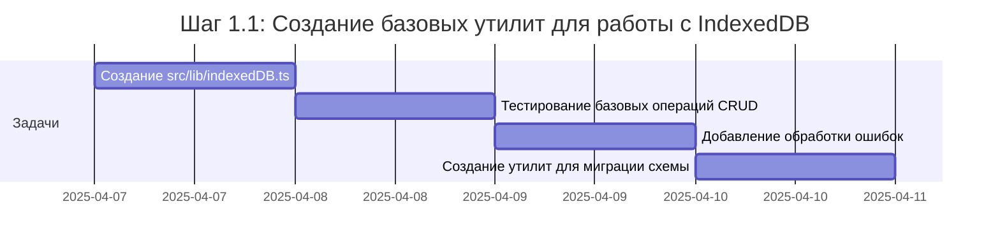

**Ответственный**: Разработчик фронтенда

**Результат**: Базовые утилиты для работы с IndexedDB, которые будут использоваться во всем приложении.

#### Шаг 1.2: Настройка Service Worker

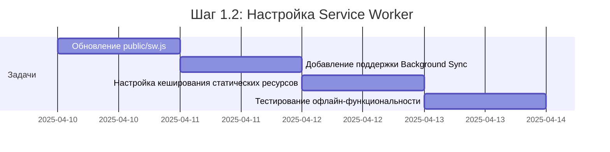

**Ответственный**: Разработчик фронтенда

**Результат**: Настроенный Service Worker с поддержкой Background Sync и кешированием статических ресурсов.

#### Шаг 1.3: Создание системы очереди синхронизации

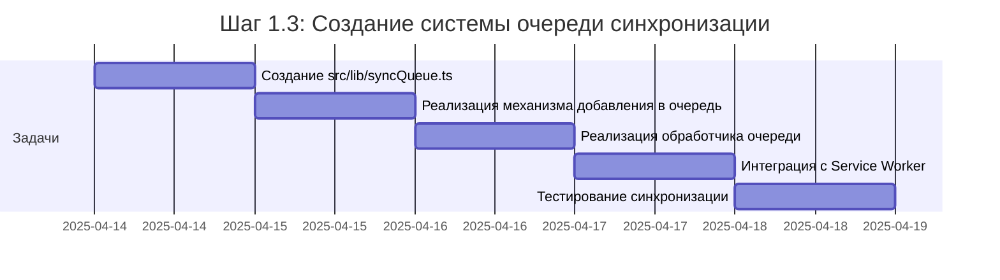

**Ответственный**: Разработчик фронтенда

**Результат**: Система очереди синхронизации для отложенной отправки данных на сервер.

### Фаза 2: Миграция основных компонентов данных

#### Шаг 2.1: Миграция транзакций на local-first

**Ответственный**: Разработчик фронтенда

**Результат**: Транзакции работают по принципу local-first, с возможностью создания и редактирования в офлайн-режиме.

#### Шаг 2.2: Миграция шаблонов на local-first

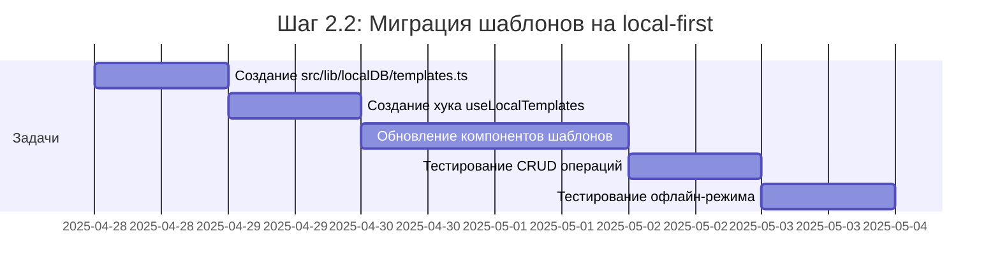

**Ответственный**: Разработчик фронтенда

**Результат**: Шаблоны работают по принципу local-first, с возможностью создания и редактирования в офлайн-режиме.

#### Шаг 2.3: Миграция сессий покупок на local-first

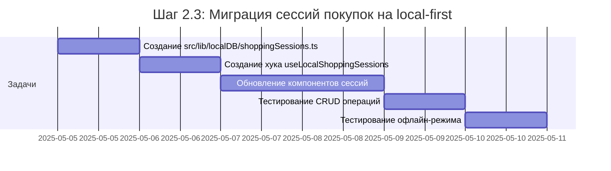

**Ответственный**: Разработчик фронтенда

**Результат**: Сессии покупок работают по принципу local-first, с возможностью создания и редактирования в офлайн-режиме.

### Фаза 3: Интеграция и оптимизация

#### Шаг 3.1: Реализация стратегии разрешения конфликтов

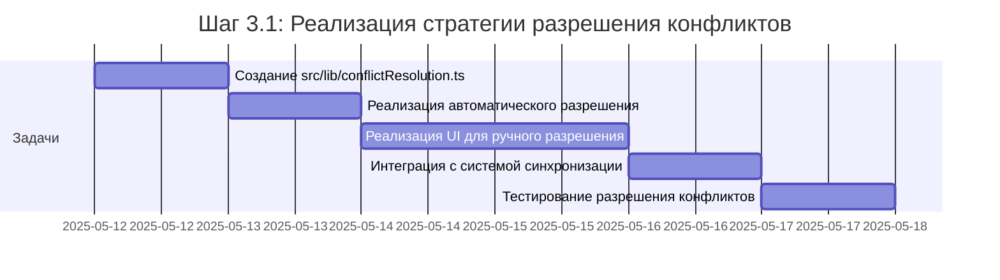

**Ответственный**: Разработчик фронтенда

**Результат**: Система разрешения конфликтов для обработки ситуаций, когда данные изменяются одновременно локально и на сервере.

#### Шаг 3.2: Оптимизация производительности

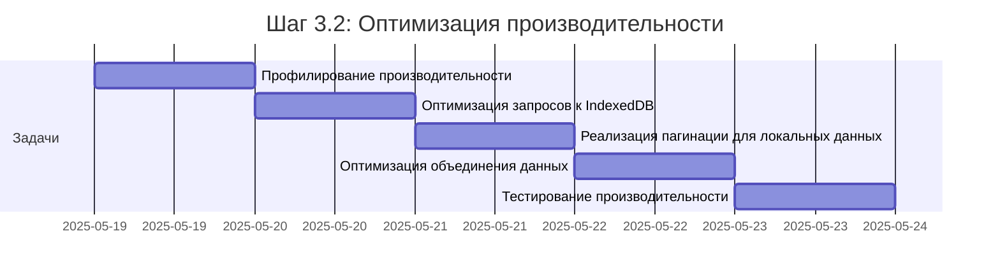

**Ответственный**: Разработчик фронтенда

**Результат**: Оптимизированная производительность приложения при работе с большими объемами данных.

#### Шаг 3.3: Улучшение UX для офлайн-режима

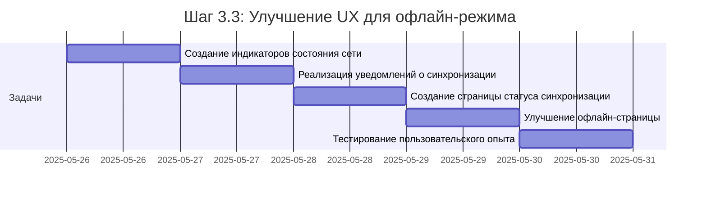

**Ответственный**: Разработчик фронтенда

**Результат**: Улучшенный пользовательский опыт при работе в офлайн-режиме, с понятными индикаторами состояния и уведомлениями.

### Фаза 4: Тестирование и развертывание

#### Шаг 4.1: Комплексное тестирование

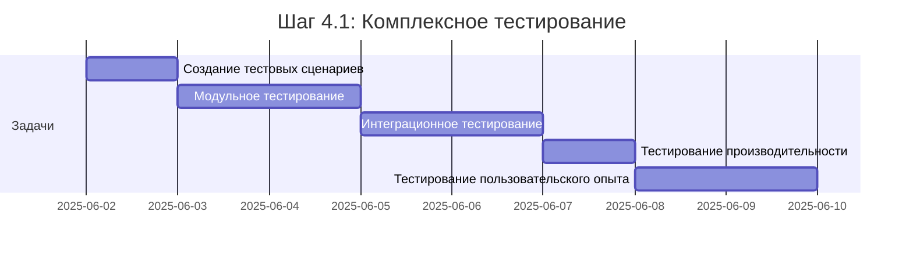

**Ответственный**: QA инженер

**Результат**: Полностью протестированная local-first архитектура, готовая к развертыванию.

#### Шаг 4.2: Поэтапное развертывание

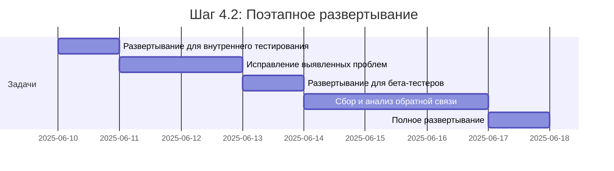

**Ответственный**: DevOps инженер

**Результат**: Поэтапное развертывание local-first архитектуры с минимальным риском для пользователей.

#### Шаг 4.3: Мониторинг и оптимизация

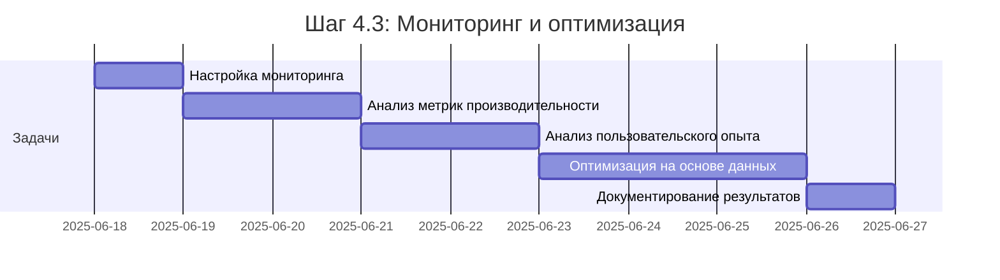

**Ответственный**: Разработчик фронтенда и аналитик

**Результат**: Оптимизированная local-first архитектура на основе реальных данных использования.

## Риски и их снижение

| Риск | Вероятность | Влияние | Стратегия снижения |
|------|-------------|---------|-------------------|
| Конфликты данных при синхронизации | Средняя | Высокое | Разработка надежной стратегии разрешения конфликтов, автоматическое разрешение где возможно, ручное разрешение для сложных случаев |
| Проблемы производительности при большом объеме данных | Средняя | Высокое | Пагинация локальных данных, индексирование, оптимизация запросов к IndexedDB |
| Несовместимость с некоторыми браузерами | Низкая | Среднее | Тестирование на различных браузерах, реализация фолбэков для браузеров без поддержки определенных API |
| Увеличение размера приложения | Низкая | Низкое | Оптимизация кода, разделение кода на чанки, ленивая загрузка |
| Сложности при обновлении схемы данных | Средняя | Среднее | Разработка системы миграции схемы IndexedDB, версионирование схемы |

## Метрики успеха

1. **Производительность**:
   - Время до интерактивности (TTI) уменьшается на 30%
   - Время отклика UI на действия пользователя < 100 мс

2. **Офлайн-возможности**:
   - 100% основных функций доступны в офлайн-режиме
   - Успешная синхронизация данных после восстановления соединения > 99%

3. **Пользовательский опыт**:
   - Увеличение удержания пользователей на 15%
   - Увеличение количества транзакций на 20%
   - Положительные отзывы о работе в офлайн-режиме > 90%

4. **Технические метрики**:
   - Снижение количества запросов к API на 40%
   - Снижение нагрузки на сервер на 30%
   - Успешное разрешение конфликтов данных > 95%

## Заключение

Миграция на local-first архитектуру будет проводиться поэтапно в течение примерно 3 месяцев. Этот подход позволит минимизировать риски и обеспечить непрерывную работу приложения. В результате пользователи получат значительно улучшенный опыт использования приложения, особенно в условиях нестабильного интернет-соединения.