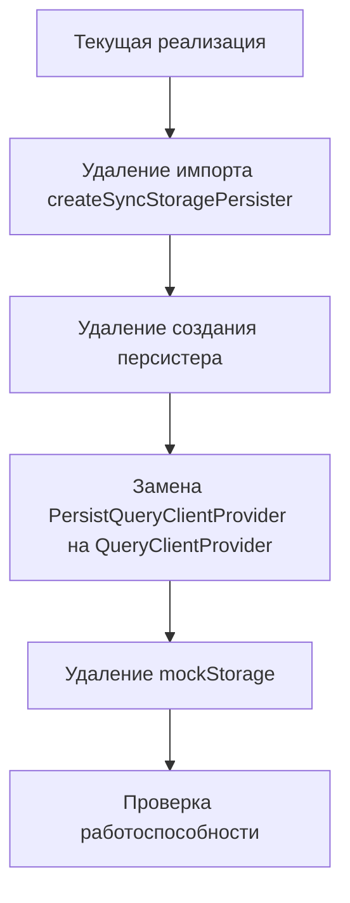

# План по удалению TRPC кэширования с использованием localStorage

## Анализ текущей реализации

В файле `src/trpc/react.tsx` используется `createSyncStoragePersister` из пакета `@tanstack/query-sync-storage-persister` для создания персистера, который сохраняет состояние запросов в localStorage. Этот персистер затем используется в `PersistQueryClientProvider` для сохранения кэша запросов между сессиями.

## План по удалению TRPC кэширования с localStorage

### 1. Изменения в файле src/trpc/react.tsx

Нам нужно:

1. Удалить импорт `createSyncStoragePersister` из `@tanstack/query-sync-storage-persister`
2. Удалить импорт `PersistQueryClientProvider` из `@tanstack/react-query-persist-client` и заменить его на `QueryClientProvider` из `@tanstack/react-query`
3. Удалить создание персистера с использованием localStorage
4. Заменить `PersistQueryClientProvider` на обычный `QueryClientProvider` из `@tanstack/react-query`
5. Удалить неиспользуемый `mockStorage` объект, который был нужен только для SSR совместимости с localStorage

### 2. Влияние на другие части приложения

Удаление кэширования TRPC может повлиять на производительность приложения, так как данные больше не будут сохраняться между сессиями. Это означает, что:

- Приложение будет делать больше запросов к серверу
- Данные будут всегда свежими, но загрузка может занимать больше времени
- Пользователи могут заметить, что приложение не сохраняет состояние между перезагрузками страницы

### 3. Проверка после внесения изменений

После внесения изменений нужно будет проверить:

- Работоспособность TRPC запросов
- Отсутствие ошибок в консоли
- Корректную работу приложения в целом

## Диаграмма изменений



## Детальный план изменений в коде

```diff
// src/trpc/react.tsx
- import { createSyncStoragePersister } from '@tanstack/query-sync-storage-persister';
- import { PersistQueryClientProvider } from '@tanstack/react-query-persist-client';
+ import { QueryClientProvider } from '@tanstack/react-query';

// Удаление mockStorage
- const mockStorage: Storage = {
-     length: 0,
-     clear() {
-     },
-     key(): string | null {
-         return null;
-     },
-     getItem(): string | null {
-         return null;
-     },
-     setItem() {
-     },
-     removeItem() {
-     },
- };

// Удаление создания персистера
- const [persister] = useState(() => createSyncStoragePersister({
-     storage: typeof window === 'undefined' ? mockStorage : window.localStorage,
- }));

// Замена PersistQueryClientProvider на QueryClientProvider
- return (
-     <PersistQueryClientProvider client={queryClient} persistOptions={{ persister, maxAge: Infinity }}>
-         <api.Provider client={trpcClient} queryClient={queryClient}>
-             {props.children}
-         </api.Provider>
-     </PersistQueryClientProvider>
- );
+ return (
+     <QueryClientProvider client={queryClient}>
+         <api.Provider client={trpcClient} queryClient={queryClient}>
+             {props.children}
+         </api.Provider>
+     </QueryClientProvider>
+ );