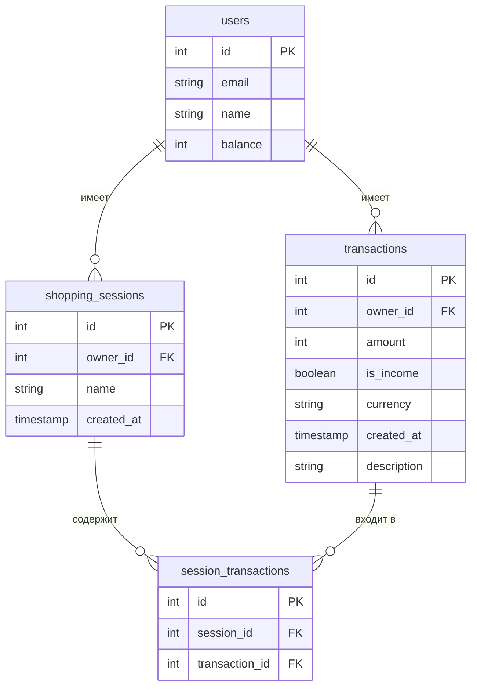
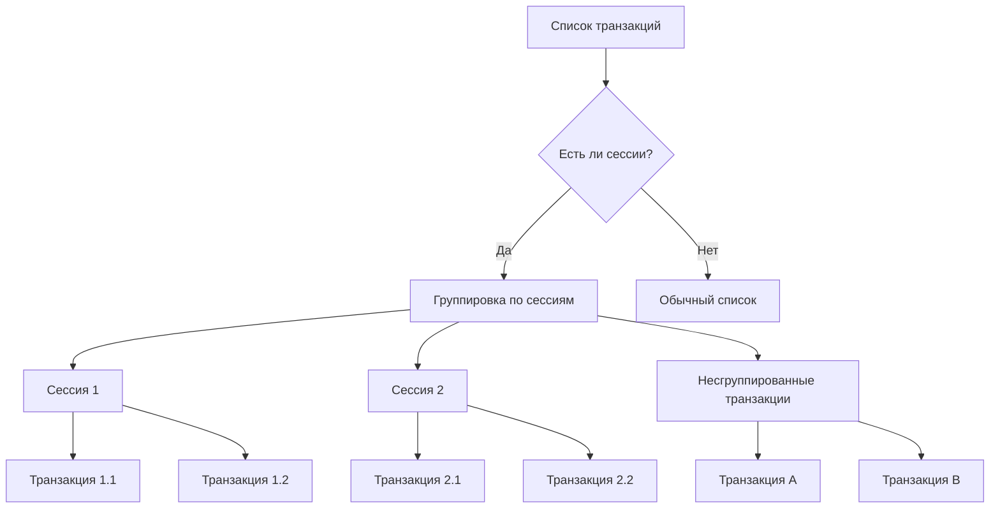
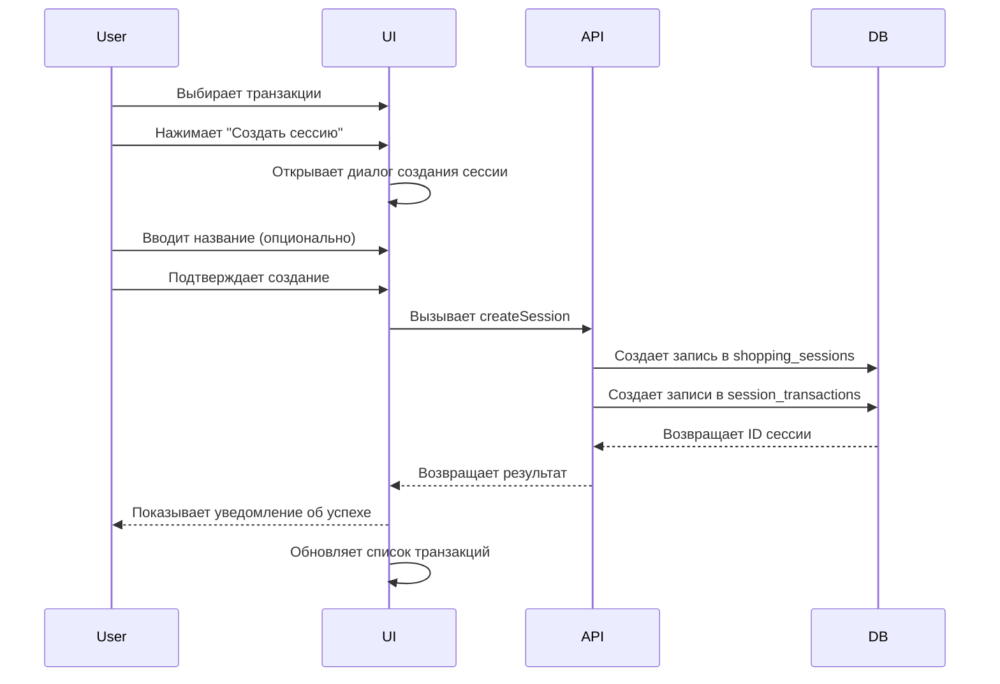

# План реализации функции "Shopping Session"

## Требования

На основе полученной информации, функция "Shopping Session" должна:

1. Позволять пользователю объединять несколько транзакций в одну "сессию покупок"
2. Существующие транзакции не должны быть модифицированы
3. "Shopping session" должны быть сгруппированы в интерфейсе
4. "Shopping session" может быть безымянной (опциональное название)
5. "Shopping session" должна иметь дату создания и общую сумму всех транзакций
6. Пользователь должен иметь возможность выбирать существующие транзакции для группировки
7. При создании новой транзакции должна быть опция добавить её в существующую или новую сессию
8. В сессию могут входить любые транзакции (как расходы, так и доходы)
9. Должна быть возможность редактировать сессию после создания (добавлять/удалять транзакции)
10. Должна быть возможность автоматического создания сессии на основе времени и места транзакций (например, если несколько транзакций сделаны в одном магазине в течение короткого времени)

## 1. Изменения в базе данных

Нам потребуется создать новую таблицу для хранения информации о сессиях покупок:



### Новые таблицы:

1. **shopping_sessions**:
   - `id`: Первичный ключ
   - `owner_id`: Внешний ключ на пользователя
   - `name`: Опциональное название сессии (может быть NULL)
   - `created_at`: Дата создания сессии
   - `auto_generated`: Флаг, указывающий, была ли сессия создана автоматически

2. **session_transactions**:
   - `id`: Первичный ключ
   - `session_id`: Внешний ключ на shopping_sessions
   - `transaction_id`: Внешний ключ на transactions

## 2. Изменения в API (TRPC роутеры)

Нам потребуется создать новый роутер для управления сессиями покупок:

### Новый роутер `shoppingSessionsRouter`:

1. **createSession**: Создание новой сессии
   - Входные данные: название (опционально), список ID транзакций
   - Выходные данные: ID созданной сессии

2. **updateSession**: Обновление существующей сессии
   - Входные данные: ID сессии, новое название, список ID транзакций для добавления/удаления
   - Выходные данные: успех/неуспех операции

3. **deleteSession**: Удаление сессии
   - Входные данные: ID сессии
   - Выходные данные: успех/неуспех операции

4. **getSessionsList**: Получение списка всех сессий пользователя
   - Входные данные: параметры пагинации, фильтры
   - Выходные данные: список сессий с основной информацией

5. **getSessionDetails**: Получение детальной информации о сессии
   - Входные данные: ID сессии
   - Выходные данные: детальная информация о сессии, включая все транзакции

6. **addTransactionsToSession**: Добавление транзакций в существующую сессию
   - Входные данные: ID сессии, список ID транзакций
   - Выходные данные: успех/неуспех операции

7. **removeTransactionsFromSession**: Удаление транзакций из сессии
   - Входные данные: ID сессии, список ID транзакций
   - Выходные данные: успех/неуспех операции

### Модификация существующего `transactionsRouter`:

1. Добавить в `getList` возможность группировки по сессиям
2. Добавить в `getSingle` информацию о сессии, если транзакция входит в сессию
3. Модифицировать `create` для возможности добавления новой транзакции в сессию
4. Добавить логику автоматического определения и создания сессии при создании новой транзакции:
   - Проверять, есть ли недавние транзакции с похожим описанием (например, в том же магазине)
   - Если такие транзакции найдены и они были созданы в течение определенного временного окна (например, 30 минут), предлагать объединить их в сессию
   - Если пользователь соглашается, автоматически создавать сессию и добавлять в неё новую и найденные транзакции

## 3. Изменения в UI

### Модификация страницы транзакций:

1. Обновить компонент `data-table.tsx` для группировки транзакций по сессиям
2. Добавить визуальное отображение группировки (например, карточки или аккордеоны)
3. Добавить возможность фильтрации по сессиям

### Новые компоненты:

1. **SessionSelector**: Компонент для выбора существующей сессии или создания новой
   - Используется при создании/редактировании транзакции

2. **SessionGroupHeader**: Заголовок группы транзакций в сессии
   - Отображает название сессии, общую сумму, количество транзакций
   - Содержит кнопки для редактирования/удаления сессии

3. **CreateSessionDialog**: Диалог для создания новой сессии
   - Форма с полем для названия и выбором транзакций

4. **EditSessionDialog**: Диалог для редактирования существующей сессии
   - Форма с полем для названия и управлением списком транзакций

## 4. Последовательность реализации

1. Создание миграций для новых таблиц
2. Реализация API (TRPC роутеров)
3. Создание базовых компонентов UI
4. Интеграция с существующим интерфейсом транзакций
5. Тестирование и отладка

## 5. Детали реализации UI

### Группировка транзакций в интерфейсе:



### Процесс создания сессии:



## 6. Технические детали реализации

### Миграция для создания новых таблиц

```sql
-- Создание таблицы shopping_sessions
CREATE TABLE shopping_sessions (
    id INTEGER PRIMARY KEY AUTOINCREMENT,
    owner_id INTEGER NOT NULL,
    name TEXT,
    created_at INTEGER NOT NULL DEFAULT (unixepoch('now')),
    FOREIGN KEY (owner_id) REFERENCES users(id) ON DELETE CASCADE
);

-- Создание таблицы session_transactions
CREATE TABLE session_transactions (
    id INTEGER PRIMARY KEY AUTOINCREMENT,
    session_id INTEGER NOT NULL,
    transaction_id INTEGER NOT NULL,
    FOREIGN KEY (session_id) REFERENCES shopping_sessions(id) ON DELETE CASCADE,
    FOREIGN KEY (transaction_id) REFERENCES transactions(id) ON DELETE CASCADE
);

-- Создание индексов для оптимизации запросов
CREATE INDEX idx_session_transactions_session_id ON session_transactions(session_id);
CREATE INDEX idx_session_transactions_transaction_id ON session_transactions(transaction_id);
CREATE INDEX idx_shopping_sessions_owner_id ON shopping_sessions(owner_id);
```

### Схема таблиц в Drizzle ORM

```typescript
// src/server/db/tables/shopping_session.ts
import { int, sqliteTable, text } from 'drizzle-orm/sqlite-core';
import { usersTable } from '@/server/db/tables/user';
import { sql } from 'drizzle-orm';

export const shoppingSessionsTable = sqliteTable('shopping_sessions', {
    id: int('id').primaryKey({ autoIncrement: true }).notNull(),
    ownerId: int('owner_id').notNull().references(() => usersTable.id, { onDelete: 'cascade' }),
    name: text('name'),
    createdAt: int('created_at', { mode: 'timestamp_ms' }).notNull().default(sql`CURRENT_TIMESTAMP`),
    autoGenerated: int('auto_generated', { mode: 'boolean' }).notNull().default(sql`0`),
});

// src/server/db/tables/session_transaction.ts
import { int, sqliteTable } from 'drizzle-orm/sqlite-core';
import { shoppingSessionsTable } from '@/server/db/tables/shopping_session';
import { transactionsTable } from '@/server/db/tables/transaction';

export const sessionTransactionsTable = sqliteTable('session_transactions', {
    id: int('id').primaryKey({ autoIncrement: true }).notNull(),
    sessionId: int('session_id').notNull().references(() => shoppingSessionsTable.id, { onDelete: 'cascade' }),
    transactionId: int('transaction_id').notNull().references(() => transactionsTable.id, { onDelete: 'cascade' }),
});
```

### Типы для Shopping Session

```typescript
// src/types/shopping-session.ts
import type { InferSelectModel } from 'drizzle-orm';
import { createInsertSchema } from 'drizzle-zod';
import { shoppingSessionsTable } from '@/server/db/tables/shopping_session';
import { sessionTransactionsTable } from '@/server/db/tables/session_transaction';
import { z } from 'zod';

export type ShoppingSession = InferSelectModel<typeof shoppingSessionsTable>;
export type SessionTransaction = InferSelectModel<typeof sessionTransactionsTable>;

export const ShoppingSessionCreateSchema = createInsertSchema(shoppingSessionsTable)
    .omit({ ownerId: true })
    .extend({
        transactionIds: z.array(z.number()),
    });

export const ShoppingSessionUpdateSchema = z.object({
    id: z.number(),
    name: z.string().optional(),
    addTransactionIds: z.array(z.number()).optional(),
    removeTransactionIds: z.array(z.number()).optional(),
});
```

## 7. Интеграция с существующим кодом

### Модификация существующих компонентов

1. Обновление формы создания/редактирования транзакции для добавления опции выбора сессии
2. Обновление компонента списка транзакций для группировки по сессиям
3. Добавление фильтрации по сессиям в поиск транзакций

### Новые компоненты

1. Создание компонентов для управления сессиями
2. Создание компонентов для отображения сгруппированных транзакций

## 8. Потенциальные проблемы и их решения

1. **Производительность при большом количестве транзакций**:
   - Использование пагинации для списка сессий
   - Оптимизация запросов с использованием индексов
   - Кэширование результатов запросов

2. **Согласованность данных**:
   - Использование транзакций базы данных для операций создания/обновления сессий
   - Валидация входных данных на уровне API

3. **UX при работе с сессиями**:
   - Интуитивно понятный интерфейс для создания/редактирования сессий
   - Четкая визуальная группировка транзакций в сессии
   - Возможность быстрого добавления/удаления транзакций из сессии

## 9. Автоматическое создание сессий

### Алгоритм определения связанных транзакций

1. При создании новой транзакции:
   - Анализировать описание транзакции для выделения ключевых слов (названия магазинов, категории и т.д.)
   - Искать недавние транзакции (за последние 30-60 минут) с похожими ключевыми словами
   - Если найдены похожие транзакции, предлагать пользователю создать сессию

2. Критерии для автоматического объединения:
   - Временная близость (транзакции созданы в течение короткого промежутка времени)
   - Семантическая близость описаний (одинаковые или похожие магазины/категории)
   - Географическая близость (если в будущем будет добавлена геолокация)

### Реализация в API

```typescript
// Пример функции для поиска похожих транзакций
async function findSimilarTransactions(
  ctx: Context,
  description: string,
  timeWindowMinutes: number = 30
): Promise<Transaction[]> {
  // Извлекаем ключевые слова из описания
  const keywords = extractKeywords(description);
  
  // Определяем временное окно
  const timeWindow = new Date();
  timeWindow.setMinutes(timeWindow.getMinutes() - timeWindowMinutes);
  
  // Ищем похожие транзакции
  const similarTransactions = await ctx.db
    .select()
    .from(transactionsTable)
    .where(and(
      eq(transactionsTable.ownerId, ctx.session.user.id),
      gte(transactionsTable.createdAt, timeWindow),
      // Логика поиска по ключевым словам
      or(...keywords.map(keyword =>
        like(transactionsTable.description, `%${keyword}%`)
      ))
    ))
    .orderBy(desc(transactionsTable.createdAt));
    
  return similarTransactions;
}

// Функция для извлечения ключевых слов из описания
function extractKeywords(description: string): string[] {
  // Простая реализация - разбиваем по пробелам и фильтруем короткие слова
  return description
    .toLowerCase()
    .split(/\s+/)
    .filter(word => word.length > 3)
    .slice(0, 3); // Берем до 3 ключевых слов
}
```

### Интеграция в UI

1. При создании новой транзакции, если найдены похожие транзакции:
   - Показывать уведомление с предложением создать сессию
   - Отображать список найденных похожих транзакций
   - Предоставлять опции:
     * Создать новую сессию с этими транзакциями
     * Добавить в существующую сессию
     * Игнорировать предложение

2. Настройки автоматического создания сессий:
   - Добавить в настройки пользователя возможность включить/отключить автоматическое предложение создания сессий
   - Настроить временное окно для поиска похожих транзакций (15, 30, 60 минут)
   - Настроить минимальное количество похожих транзакций для предложения создания сессии